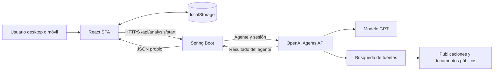
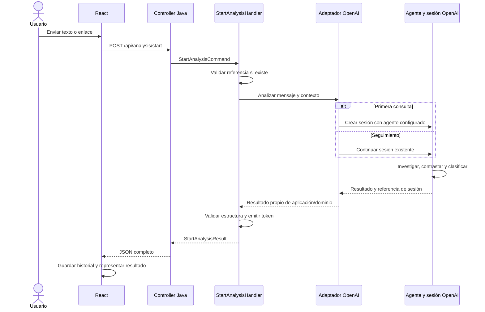
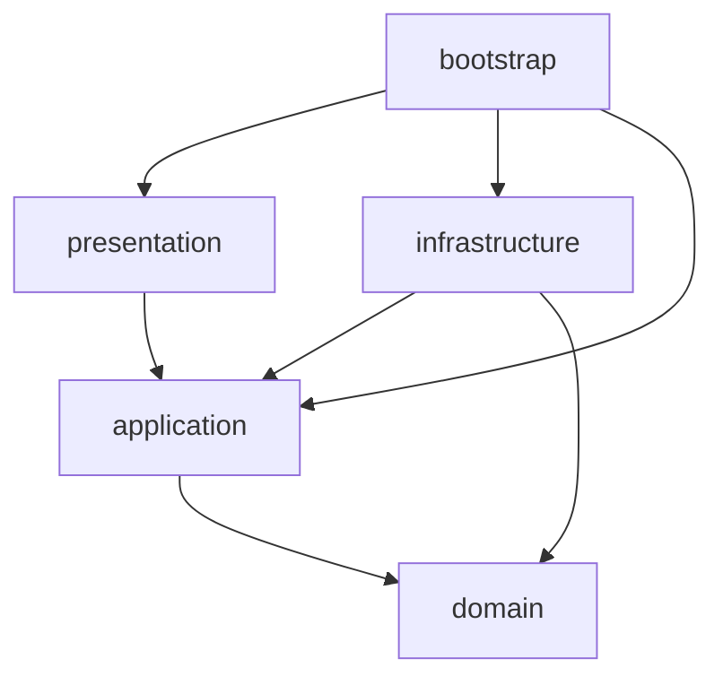

# Arquitectura del sistema — PoC inicial (pre-MVP)

- **Versión:** 1.0
- **Fecha:** 15 de septiembre de 2026
- **Estado:** propuesta técnica alineada con el alcance acordado; no describe una implementación ya construida.
- **Requisitos:** [Requisitos y funcionalidad](requisitos-funcionales-poc-pre-mvp.md).
- **Diseño:** [Desktop v4](../Mockups/desktop-v4.png) y [móvil v4](../Mockups/mobile-v4.png).
- **Marca:** provisional; Contrasta / CrossCheck.

## 1. Objetivos y decisiones principales

Construir una aplicación responsive que permita contrastar texto y enlaces mediante un agente especializado de análisis político.

| Decisión | Aplicación en esta fase |
|---|---|
| Frontend | React + TypeScript, SPA construida con Vite |
| Backend | Java + Spring Boot, un único despliegue |
| Organización Java | Clean Architecture con vertical slices y separación conceptual de commands y queries |
| API de negocio | Solo `POST /api/analysis/start` |
| IA | Agente guardado en OpenAI, seleccionado desde configuración del servidor |
| Persistencia propia | Sin base de datos ni almacenamiento de archivos de usuario en el servidor |
| Historial | Navegador, mediante localStorage |
| Contexto del agente | Sesiones en OpenAI |
| Identidad | Ale Jiménez, usuario simulado sin autenticación |
| Categoría | Análisis político, única opción activa |
| Transporte inicial | HTTP con resultado completo; sin SSE, WebSocket, colas ni workers |

Las versiones concretas de Java, Spring Boot, React y SDK se fijarán al implementar, verificando compatibilidad. El modelo GPT también será configuración explícita, no una dependencia del dominio.

## 2. Arquitectura general



### 2.1. Componentes y responsabilidades

| Componente | Responsabilidad | No realiza |
|---|---|---|
| React SPA | Consulta, navegación, resultados, indicadores, historial y preferencias | No llama directamente a OpenAI ni determina la verdad de una afirmación |
| Almacenamiento local | Conversaciones y preferencias de ese navegador | No sincroniza dispositivos ni representa una cuenta |
| Spring Boot | Validación de entrada, continuación de sesiones, integración, adaptación de respuestas y derivación determinista de la valoración final | No investiga, rastrea sitios ni contrasta afirmaciones |
| Agente OpenAI | Investigación, contraste, síntesis, veredicto y clasificación de publicaciones | Su resultado no se considera infalible por estar bien estructurado |
| Sesión OpenAI | Contexto y trabajo de una conversación | No sustituye al historial de presentación local |
| Fuentes externas | Material consultado por las herramientas del agente | No son instrucciones confiables para cambiar su comportamiento |

### 2.2. Límites del sistema

No se incorporan PostgreSQL, Redis, almacenamiento de objetos, base vectorial, motor propio de búsqueda ni servicio de archivos. Las páginas informativas y definiciones de configuración forman parte del código distribuido.

«Sin sistema de ficheros» significa sin almacenamiento de documentos, informes o adjuntos en tiempo de ejecución. Los archivos de código, dependencias y recursos estáticos siguen siendo necesarios.

El sistema no es completamente carente de estado: el navegador y OpenAI conservan datos. El backend no guarda estado duradero, aunque puede mantener contadores o exclusiones temporales en memoria.

## 3. Flujo de ejecución



Una petición desde React puede provocar varias operaciones de herramientas y pasos de modelo dentro del agente. No se promete que equivalga a una sola inferencia o a un único coste.

La aplicación espera a que finalice el análisis y muestra progreso genérico durante la espera. Si el SDK utiliza eventos internamente, el adaptador los consume sin exponer todavía un canal de streaming al navegador.

## 4. Arquitectura del frontend

### 4.1. Enfoque

SPA organizada por funcionalidades. React gestiona la interfaz; TypeScript define los contratos de datos. Vite proporciona desarrollo y compilación. Se propone enrutado de cliente para conversaciones y páginas informativas.

No es necesario replicar las cuatro capas del backend en el frontend. Se separan componentes, estado, acceso HTTP y almacenamiento para que la interfaz pueda evolucionar sin mezclar estas responsabilidades.

### 4.2. Estructura propuesta

```text
frontend/
  src/
    app/
      App.tsx
      router.tsx
      providers/
        ConversationProvider.tsx
        PreferencesProvider.tsx
      layout/
        AppShell.tsx
        Header.tsx
        Sidebar.tsx
        MobileNavigation.tsx

    features/
      conversations/
        components/
          ConversationPage.tsx
          ConversationList.tsx
          MessageList.tsx
          MessageComposer.tsx
          CategorySelector.tsx
        model/
          conversation.ts
          conversationReducer.ts
        hooks/
          useConversation.ts
        storage/
          conversationStorage.ts

      analysis/
        api/
          startAnalysis.ts
          analysisContract.ts
        components/
          AnalysisResult.tsx
          ContextSection.tsx
          SummarySection.tsx
          VerdictCard.tsx
          SourcesList.tsx
          PublicationPositionsPanel.tsx
          PublicationBreakdown.tsx
          AnalysisError.tsx
        model/
          analysisTypes.ts
          verdictPresentation.ts
          publicationMetrics.ts
          analysisResponseValidator.ts

      profile/
        components/
          ProfileMenu.tsx
          ProfilePage.tsx
          PreferencesPage.tsx
        model/
          demoUser.ts

      information/
        pages/
          AboutPage.tsx
          HowItWorksPage.tsx
          UsagePolicyPage.tsx
          PrivacyPage.tsx
          HelpPage.tsx

    shared/
      api/
        httpClient.ts
        apiError.ts
      storage/
        localStorageAdapter.ts
      ui/
        Button.tsx
        Dialog.tsx
        Badge.tsx
      styles/
        tokens.css
        global.css
```

Los nombres son orientativos. No se deben crear abstracciones sin uso real ni convertir `shared` en un contenedor de lógica específica de análisis.

### 4.3. Estado

Para este tamaño se propone Context + reducer para conversaciones y preferencias, y estado local para formularios y menús. No se requiere un gestor global adicional.

| Tipo de estado | Ubicación |
|---|---|
| Texto sin enviar, menú abierto | Memoria del componente |
| Conversación activa y mensajes | Estado de React |
| Historial, títulos y resultados terminados | localStorage |
| Tema visual | localStorage |
| Petición en curso y error | Memoria; al recargar no se reenvía automáticamente |
| Credenciales OpenAI | Nunca en frontend |

Modelo local orientativo:

```text
Conversation
  id                      identificador local
  category                POLITICAL_ANALYSIS
  title
  createdAt
  updatedAt
  conversationToken       referencia opaca del backend
  messages[]
    id
    role
    text
    analysis              resultado, cuando corresponda
    status
```

Se usará una clave de almacenamiento con versión de esquema. Se validarán los datos al leerlos. Si están corruptos o exceden cuota, la interfaz informará y permitirá continuar temporalmente en memoria.

El borrado local no implica borrado remoto. La pérdida de localStorage impide recuperar el historial desde la aplicación en esta fase.

### 4.4. Presentación del análisis

- `context`: antecedentes, plegable si es extenso.
- `summary`: texto y referencias.
- `verdict`: tarjeta con estado, explicación y respaldo documental.
- `sources`: fuentes y aportación de cada una.
- `publicationPositions`: clasificación de publicaciones y desglose.

El mapa de estados a color/icono es determinista y está en `verdictPresentation.ts`. No se renderiza HTML proporcionado por el agente. Si se admite Markdown, se sanitiza y se restringen los enlaces a protocolos seguros.

La clasificación editorial corresponde al agente. El frontend calcula recuentos y porcentajes sobre las unidades deduplicadas devueltas:

```text
N = número de unidades clasificadas
porcentaje(posición) = 100 × número de unidades de esa posición / N
```

Mixtas y sin posición permanecen en el denominador. Si no hay clasificación o `N = 0`, se muestra «Medición no disponible» o «No calculable». Nunca se reutiliza el 80 % ficticio de los mockups como dato de producción.

### 4.5. Navegación y responsive

Rutas orientativas de frontend, independientes de la API:

```text
/                       nueva conversación
/conversations/:id      historial local seleccionado
/profile
/preferences
/about
/how-it-works
/usage-policy
/privacy
/help
```

En escritorio, barra lateral permanente y cuenta arriba a la derecha. En móvil, menú colapsado, una columna y controles táctiles legibles. El porcentaje se muestra en un panel separado del veredicto.

El hosting de la SPA deberá resolver sus rutas de cliente hacia `index.html`.

## 5. Arquitectura del componente Java

### 5.1. Principios

- **Clean Architecture:** dependencias de código hacia dominio y aplicación.
- **Vertical slices:** casos de uso agrupados por operación, empezando por `analysis/start`.
- **Commands y queries:** separación de intención; solo command en esta fase.
- **Inversión de dependencias:** aplicación define el contrato de IA y OpenAI lo implementa.
- **Un solo despliegue:** no microservicios ni infraestructura de mensajería.

Esta organización no elimina los contratos o puertos. Son el mecanismo de inversión de dependencias, compatible con la organización por slices.

### 5.2. Distribución física

Se propone un proyecto Maven agregador con cinco módulos para hacer explícitas las dependencias. Todos producen una única aplicación ejecutable, ensamblada desde `bootstrap`.

```text
backend/
  pom.xml
  domain/
  application/
  infrastructure/
  presentation/
  bootstrap/
```

Los paquetes Java se escriben en minúsculas. El paquete raíz definitivo se fijará con la identidad del proyecto.

### 5.3. Árbol lógico de clases

```text
domain/
  analysis/
    AnalysisCategory
    AnalysisReport
    Verdict
    VerdictStatus
    Evidence
    PublicationAssessment
    PublicationPosition

application/
  contracts/
    AiPoliticalAnalysisService
    ConversationReferenceCodec
  model/
    AiAnalysisInput
    AiAnalysisTurn
    ConversationReference
  features/
    analysis/
      common/
        dto/
          AnalysisResult
          SourceResult
          VerdictResult
          PublicationPositionsResult
      start/
        StartAnalysisCommand
        StartAnalysisHandler
        StartAnalysisResult
        AnalysisResultMapper
  error/
    InvalidConversationReferenceException
    AnalysisProviderException
    InvalidAnalysisOutputException

infrastructure/
  openai/
    OpenAiPoliticalAnalysisService
    OpenAiResultMapper
    OpenAiOutputSchema
  conversation/
    EncryptedConversationReferenceCodec

presentation/
  api/
    analysis/
      start/
        StartAnalysisController
        StartAnalysisRequest
        StartAnalysisResponse
        StartAnalysisHttpMapper
    error/
      ApiExceptionHandler
      ApiErrorResponse

bootstrap/
  Application
  configuration/
    AnalysisConfiguration
    OpenAiConfiguration
    ConversationReferenceConfiguration
    WebConfiguration
```

Los directorios del árbol representan paquetes, dentro de la estructura estándar `src/main/java` de cada módulo.

El slice atraviesa conceptualmente la entrada HTTP y el caso de uso, pero ambos permanecen en sus módulos para preservar Clean Architecture. No se colocan anotaciones HTTP en la aplicación para forzar un único directorio físico por endpoint.

### 5.4. Dependencias permitidas



- `domain`: Java puro, sin Spring, JSON, HTTP ni SDK.
- `application`: Java puro; depende del dominio.
- `presentation`: Spring MVC, validación HTTP y serialización.
- `infrastructure`: SDK/cliente OpenAI y criptografía.
- `bootstrap`: Spring Boot y ensamblado mediante beans.

El controller no instancia el SDK. El handler no importa clases de OpenAI. El dominio no conoce el token cifrado, códigos HTTP ni variables de entorno.

### 5.5. Dominio

El dominio es deliberadamente pequeño. Representa los resultados y estados que utiliza el producto, no un motor de verificación.

`AnalysisReport` contiene contexto, síntesis, valoración, fuentes y evaluación de publicaciones. Sus reglas son estructurales: estados admitidos, identificadores y ausencia de ambigüedades de formato.

No contiene reglas Java para decidir si existe lawfare, si una noticia es falsa o si una fuente es fiable.

`AnalysisResult` representa la salida de aplicación. La separación respecto al dominio permite cambiar el contrato de exposición sin introducir detalles HTTP o del proveedor en el modelo interno. Los mapeos se mantendrán mínimos.

### 5.6. Application y CQRS

`StartAnalysisCommand` expresa la intención de analizar un mensaje. `StartAnalysisHandler` ejecuta ese caso de uso y puede devolver un resultado; CQRS no exige commands sin respuesta.

Secuencia del handler:

1. Validar restricciones propias del caso de uso.
2. Resolver la referencia de conversación si existe.
3. Solicitar el análisis a `AiPoliticalAnalysisService`.
4. Recibir un resultado normalizado independiente del SDK.
5. Comprobar formato y referencias estructurales.
6. Emitir una referencia opaca para continuar.
7. Devolver `StartAnalysisResult`.

Se propone handler concreto, sin interfaz por cada caso de uso. Los contratos se reservan para dependencias externas y sustituibles.

No se implementan bus CQRS, mediator, event sourcing, eventos de dominio, read models ni bases separadas. Tampoco se crea `getbyid` vacío.

### 5.7. Contratos orientativos

```java
public interface AiPoliticalAnalysisService {
    AiAnalysisTurn analyze(AiAnalysisInput input);
}

public interface ConversationReferenceCodec {
    ConversationReference decode(String token);
    String encode(ConversationReference reference);
}

public record StartAnalysisCommand(
    String text,
    String conversationToken
) {}

public record StartAnalysisResult(
    String conversationToken,
    AnalysisResult analysis
) {}
```

Son ejemplos de intención, no contratos compilables definitivos. Se fijará de forma consistente la representación de ausencia de token al implementar.

La política de categoría única reside en servidor. El navegador no elige arbitrariamente un modelo, agente o sesión externa.

### 5.8. Infrastructure

`OpenAiPoliticalAnalysisService` implementa el contrato y concentra:

- Creación o continuación de sesión.
- Conversión de entrada al formato del proveedor.
- Recepción de finalización, fallos y resultado.
- Mapeo de DTO externos al modelo propio.
- Traducción de errores y límites de tiempo.

`EncryptedConversationReferenceCodec` cifra y autentica la referencia de sesión. Ambos componentes se inyectan desde `bootstrap`.

### 5.9. Presentation

`StartAnalysisController` recibe JSON, valida entrada HTTP y delega. No contiene instrucciones del agente ni interpretación de evidencias.

`ApiExceptionHandler` convierte excepciones conocidas en errores estables. Las trazas internas y cuerpos sensibles del proveedor no se devuelven al cliente.

## 6. Contrato HTTP propuesto

### 6.1. Entrada

```http
POST /api/analysis/start
Content-Type: application/json
```

```json
{
  "text": "El gobierno habla de lawfare en los casos abiertos, ¿qué valoración haces?",
  "conversationToken": null
}
```

- Token ausente o nulo: primera consulta.
- Token válido: nuevo análisis dentro de la conversación.
- Un mensaje puede incluir URLs como texto.
- No se envía el historial completo ni un identificador de agente elegido por el navegador.
- Límite de longitud configurable.

### 6.2. Respuesta

```json
{
  "conversationToken": "token-opaco",
  "analysis": {
    "title": "Título del análisis",
    "context": "Contexto",
    "summary": "Síntesis",
    "verdict": {
      "status": "INSUFFICIENT_EVIDENCE",
      "explanation": "Explicación vinculada a las evidencias",
      "documentarySupport": "Insuficiente",
      "sourceIds": []
    },
    "sources": [],
    "publicationPositions": {
      "availability": "UNAVAILABLE",
      "reason": "No se ha realizado una clasificación suficiente",
      "proposition": "Proposición evaluada",
      "period": null,
      "selectionCriteria": null,
      "units": [],
      "excluded": []
    },
    "limitations": [],
    "analyzedAt": "2026-09-15T12:00:00Z",
    "asOf": null
  }
}
```

Ejemplo de estructura, no resultado real. `analyzedAt` se asigna por el servidor; `asOf` describe el corte de la evidencia cuando se conozca. El backend no inventa fechas desconocidas.

Cada unidad de `publicationPositions.units` incluirá:

```text
id
sourceIds              una pieza o varias reproducciones agrupadas
position               SUPPORTS / QUESTIONS / MIXED / NO_EXPLICIT_POSITION
explanation
```

La decisión de agrupar y clasificar pertenece al agente. El código comprueba identificadores y formato. Los porcentajes se derivan en React de estas unidades, evitando una segunda cifra que pueda contradecir el listado.

La lista `sources` contiene los datos necesarios para identificar las publicaciones referenciadas. Un documento oficial puede respaldar el análisis sin contarse como una publicación con posición editorial.

### 6.3. Errores

| HTTP propuesto | Situación |
|---|---|
| 400 | Entrada inválida o referencia incorrecta |
| 409 | Sesión ocupada o conflicto detectado |
| 410 | Referencia caducada o sesión confirmada como no disponible |
| 429 | Límite local de uso o concurrencia |
| 502 | Respuesta del proveedor no utilizable o formato inválido |
| 503 | Proveedor temporalmente no disponible |
| 504 | Se agotó el tiempo de espera |

```json
{
  "code": "ANALYSIS_TIMEOUT",
  "message": "El análisis ha superado el tiempo de espera.",
  "requestId": "identificador-de-diagnostico",
  "executionState": "UNKNOWN"
}
```

Un timeout no demuestra que la ejecución remota se haya detenido. El error debe expresar incertidumbre cuando exista.

## 7. Agente y sesiones OpenAI

La configuración guardada permite iniciar sesiones con un identificador de agente; la configuración reutilizable y la conversación son objetos diferentes. La documentación oficial describe esta separación en [Configuring Agents](https://developers.openai.com/api/docs/guides/agents-api/configuration).

La continuación se realiza sobre la sesión existente según el flujo del proveedor. Referencia: [Run and continue sessions](https://developers.openai.com/api/docs/guides/agents-api/sessions).

Antes de implementar se comprobarán acceso de la cuenta, versión de SDK Java, capacidades del modelo, búsqueda y salida estructurada en la API seleccionada. No se sustituirá silenciosamente el diseño por otra API si falta una capacidad.

### 7.1. Configuración del agente

- Instrucciones de análisis político.
- Uso de herramientas para recuperar fuentes.
- Distinción entre hechos, declaraciones y opiniones.
- Estados de valoración y límites.
- Esquema de salida compatible con el contrato.
- Reglas de clasificación de publicaciones.
- Límites de ejecución y consumo compatibles con la API.

Se conservará una definición versionada en el repositorio como configuración de desarrollo/despliegue. El agente se crea o actualiza como tarea de configuración, no con cada petición de usuario. Para esta fase se evitará modificar una definición mientras existan conversaciones que deban conservar su comportamiento; las revisiones se identificarán explícitamente.

La persistencia del agente no implica contexto gratuito. La PoC medirá el consumo real informado por el proveedor.

### 7.2. Referencia de conversación

Propuesta: token con cifrado autenticado mediante una biblioteca mantenida, sin diseñar criptografía propia. Contendrá referencia de sesión, categoría, revisión del agente y caducidad.

- Clave solo en servidor.
- No se acepta un session ID arbitrario enviado directamente por el cliente.
- Validación de integridad y caducidad antes de continuar.
- Sin contenido de mensajes dentro del token.
- No se incluye en URLs ni logs.
- Cambiar la clave invalida referencias anteriores.
- Mantener la clave permite decodificarlas tras reiniciar, pero no garantiza disponibilidad remota.

El token es una credencial portadora. Sin autenticación, quien lo posea podría continuar la conversación. No existe aislamiento entre usuarios autenticados porque aún no existen usuarios reales.

## 8. Fallos, concurrencia y límites del enfoque sin persistencia

### 8.1. Peticiones largas

El timeout del proveedor debe quedar por debajo del timeout total del servidor y del cliente/proxy, con margen para devolver un error. Los valores se fijarán mediante pruebas.

No se reintentará automáticamente un inicio con desenlace incierto: podría generar otra sesión o repetir trabajo. La recuperación tras cierres del navegador o reinicios del servidor no está garantizada en esta fase.

Si una ejecución finaliza en OpenAI pero la respuesta no llega a React, el resultado puede no quedar en el historial local. Resolver este caso con garantías requerirá evolución del protocolo o persistencia.

### 8.2. Concurrencia

La UI deshabilita nuevos envíos mientras hay uno pendiente en esa conversación. Un control temporal en memoria puede evitar ejecuciones simultáneas en la misma instancia Java.

No se promete exclusión global entre múltiples instancias ni ejecución exactamente una vez. El despliegue inicial tendrá una instancia de backend.

### 8.3. Validación técnica

Se validan campos obligatorios, tipos, estados permitidos, límites, unicidad de identificadores y referencias dentro del resultado. La aplicación no vuelve a leer las fuentes ni cambia el veredicto por criterios políticos.

Una inconsistencia de formato se comunica como problema técnico; no se convierte en «Evidencia insuficiente». Una clasificación no disponible puede coexistir con un análisis válido.

## 9. Seguridad y privacidad de la demo

- HTTPS en despliegue.
- Clave OpenAI exclusivamente en backend.
- Configuración de orígenes permitidos; CORS no es autenticación.
- Acceso controlado a una demo publicada y límites de consumo.
- Salida de IA y datos locales tratados como contenido no confiable al renderizar.
- Sin ejecución de HTML del agente.
- Sin descarga propia de URLs de usuario: la recuperación pertenece a las herramientas del agente.
- Instrucciones para tratar las fuentes como datos, no como órdenes.
- Logs en salida estándar con request ID, duración, estado y consumo disponible, sin textos completos ni tokens.
- Política visible que distinga datos locales de datos enviados a OpenAI.

## 10. Despliegue y configuración

### Desarrollo

Dos procesos: servidor Vite y Spring Boot. Se propone proxy de desarrollo de `/api` hacia Java. No se requiere Docker para arrancar, aunque podrán definirse contenedores sin volúmenes de datos.

### Demo desplegada

Frontend estático y backend Java, preferentemente expuestos bajo un mismo origen mediante proxy. Un proveedor de hosting se seleccionará después; no forma parte de esta decisión.

```text
/          → recursos estáticos React
/api/*     → Spring Boot
```

Configuración propuesta:

| Variable | Uso |
|---|---|
| `OPENAI_API_KEY` | Credencial del proveedor |
| `OPENAI_POLITICAL_AGENT_ID` | Agente permitido |
| `POLITICAL_AGENT_REVISION` | Revisión interna de configuración |
| `CONVERSATION_TOKEN_SECRET` | Clave de protección de referencias |
| `CONVERSATION_TOKEN_TTL` | Caducidad |
| `ALLOWED_FRONTEND_ORIGIN` | Origen permitido |
| `ANALYSIS_TIMEOUT` | Tiempo máximo |
| `MAX_INPUT_LENGTH` | Tamaño máximo de consulta |
| `MAX_CONCURRENT_ANALYSES` | Protección de concurrencia |

No se publican secretos en archivos versionados ni variables compiladas en React.

## 11. Verificación de la implementación

### Frontend

- Mapeo de veredictos y estados de error.
- Cálculo de porcentajes con cero unidades, duplicados ya agrupados y clases mixtas.
- Historial local, datos corruptos y cuota.
- Nueva conversación y seguimiento.
- Legibilidad desktop/móvil, teclado y enlaces seguros.

### Java

- Handler con proveedor simulado.
- Controller: validación, contrato y errores.
- Adaptador: resultado correcto, error remoto, timeout y formato inválido.
- Token: ida y vuelta, manipulación y caducidad.
- Reglas de dependencia entre módulos, con pruebas de arquitectura cuando se implemente.

### Prueba integrada

Consulta real, seguimiento y conversación independiente. Comprobar fuentes y clasificación con ejemplos revisables, y registrar latencia y consumo. Las evaluaciones de calidad de IA son distintas de los tests de formato.

## 12. Evolución prevista

| Necesidad futura | Cambio esperado |
|---|---|
| Autenticación e historial sincronizado | Identidad real, autorización y repositorios |
| Recuperación por ID | Slice query `analysis/getbyid` y contrato de persistencia |
| Análisis largos recuperables | Trabajo duradero, estado consultable y notificaciones/streaming |
| Categorías nuevas | Registro de configuración de agentes y políticas de salida |
| Multimedia | Preparación de entradas y almacenamiento específico |
| Corpus documental | Recuperación sobre colección propia, si se justifica |
| Varias instancias | Control distribuido de concurrencia y recuperación |

Estas extensiones no se implementan anticipadamente. El alcance actual se mantiene en un frontend, un backend y la integración con el agente.


### Valoración documental y valoración final: contrato definitivo

| Código final | Etiqueta | Cuándo corresponde | Color / icono |
|---|---|---|---|
| `SUPPORTED` | Respaldada | La evidencia apoya la afirmación. | Verde / círculo con comprobación |
| `REFUTED` | Refutada | La evidencia contradice la afirmación. | Rojo / círculo con cruz |
| `MISLEADING` | Engañosa o fuera de contexto | Elementos ciertos presentados con omisiones o contexto que inducen a error. | Ámbar / triángulo de advertencia |
| `INSUFFICIENT_EVIDENCE` | Evidencia insuficiente | No hay base documental suficiente y no procede una valoración editorial derivada. | Gris / círculo con interrogación |
| `OPINION` | Interpretación u opinión | Juicio de valor no comprobable directamente como verdadero o falso. | Azul / bocadillo de diálogo |
| `NO_SINGLE_VERDICT` | Sin veredicto único | Varias afirmaciones o dimensiones requieren conclusiones diferenciadas. | Gris azulado / caminos que se bifurcan |
| `SUPPORTED_BY_PUBLICATIONS` | Respaldada por las publicaciones | Evidencia insuficiente con predominio estricto de SUPPORTS. | Verde suave / periódico |
| `QUESTIONED_BY_PUBLICATIONS` | Cuestionada por las publicaciones | Evidencia insuficiente con predominio estricto de QUESTIONS. | Coral suave / periódico |

El proveedor devuelve uno de los seis estados documentales originales; el esquema del agente mantiene esos seis valores. La API propia admite los ocho estados finales. `FinalVerdictPolicy`, en Application, se ejecuta durante el mapeo del informe validado y deriva los dos estados nuevos solo desde INSUFFICIENT_EVIDENCE. Los estados derivados recibidos del proveedor se rechazan como salida inválida.

Se comparan recuentos de unidades deduplicadas de las cuatro posiciones. Una reproducción adicional dentro de una unidad no añade votos; las exclusiones no cuentan. Se exige un máximo único, no mayoría absoluta ni porcentajes redondeados. MIXED o NO_EXPLICIT_POSITION predominante, empate en el máximo, cero unidades o UNAVAILABLE conserva INSUFFICIENT_EVIDENCE. Los otros cinco estados documentales no cambian.

La explicación derivada comienza con «La evidencia disponible no permite respaldar ni refutar la afirmación», identifica el predominio en la muestra y conserva la explicación original, el respaldo documental y sus referencias. No se convierte consenso editorial en evidencia factual.

React muestra etiqueta, explicación, color e icono según el estado final. Se mantiene el panel de publicaciones a la derecha en escritorio y después del análisis y antes de fuentes en móvil, sin adoptar v6. El agente contrasta la proposición de fondo, explicita su interpretación y pide aclaración cuando falte contexto determinante.