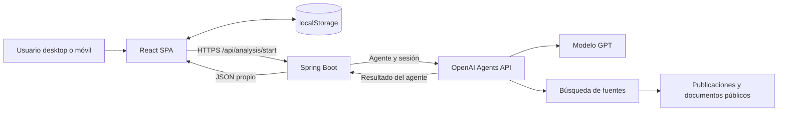
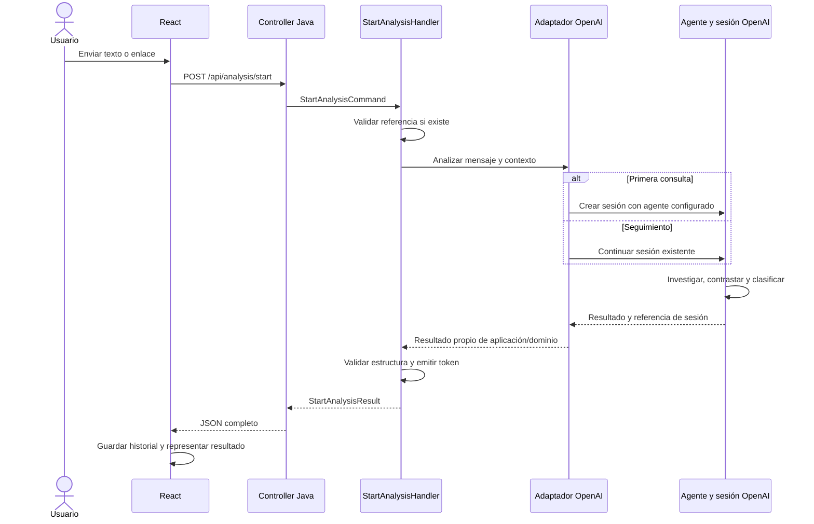
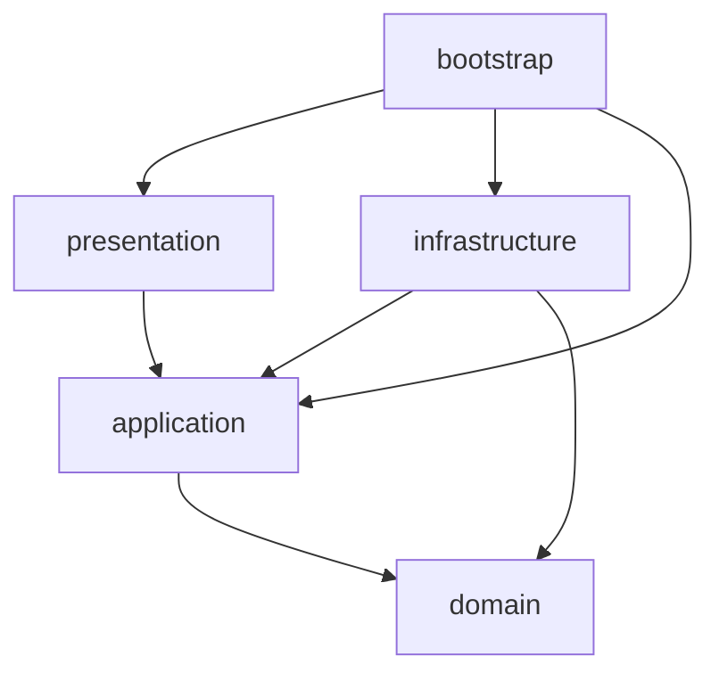

# Arquitectura del sistema — PoC inicial (pre-MVP)

Actualización political-v15: `selectionCriteria` público procede de las reglas de Java, no de la redacción del proveedor; UNAVAILABLE conserva null. No cambia el contrato HTTP. [Verificación](../POC/cross-check-service/docs/openai/political-v15-review.md).

Actualización political-v14: el paquete separa observaciones de investigación no verificadas de limitaciones de captura. Las primeras ya no se publican automáticamente como hechos. Los documentos omitidos se identifican mediante metadatos de descubrimiento explícitamente no verificados. [Detalle](../POC/cross-check-service/docs/openai/political-v14-review.md).

Actualización political-v13: el esquema interno de síntesis y Java exigen siempre una explicación no vacía en `publicationPositions.reason`. El contrato público v3 no cambia. Una síntesis real con el expediente guardado terminó COMPLETED; no equivale a una nueva ejecución completa desde el frontend. [Verificación y límites](../POC/cross-check-service/docs/openai/political-v13-review.md).

Actualización political-v12 (01/10/2026): el paquete de síntesis separa fuentes omitidas y candidatos, con listas de hallazgos permitidos y decisiones elegibles calculadas en Java. El validador conserva las restricciones; contrato público v3 sin cambios. [Implementación y validación offline](../POC/cross-check-service/docs/openai/political-v12-review.md). Pendiente una síntesis real satisfactoria.

## Actualización implementada — 01/10/2026

Political-v11 separa investigación OpenAI, captura independiente de documentos y síntesis sin herramientas. El expediente, las referencias y los cambios de etapa se persisten en H2; investigación y síntesis usan sesiones distintas conservando la conversación lógica. Java valida citas, asigna IDs y ensambla fuentes y fechas. El contrato HTTP del informe sigue en v3 y el frontend conserva la entrega asíncrona.

Implementación y límites: [expediente de evidencia](../POC/cross-check-service/docs/evidence-dossier.md). La compilación y 333 pruebas pasan (otras dos omitidas), además de 16 escenarios de navegador offline. **La aceptación real sigue fallida:** la síntesis generó referencias inválidas y una clasificación temporal inadmisible. [Revisión real v11](../POC/cross-check-service/docs/openai/political-v11-live-review.md). El diseño inicial de abajo se conserva como antecedente.

- **Versión:** 1.0
- **Fecha:** 15 de septiembre de 2026
- **Estado:** propuesta técnica alineada con el alcance acordado; no describe una implementación ya construida.
- **Requisitos:** [Requisitos y funcionalidad](requisitos-funcionales-poc-pre-mvp.md).
- **Diseño:** [Desktop v4](../Mockups/desktop-v4.png) y [móvil v4](../Mockups/mobile-v4.png).
- **Marca:** provisional; Contrasta / CrossCheck.

## 1. Objetivos y decisiones principales

Construir una aplicación responsive que permita contrastar texto y enlaces mediante un agente especializado de análisis político.

| Decisión | Aplicación en esta fase |
|---|---|
| Frontend | React + TypeScript, SPA construida con Vite |
| Backend | Java + Spring Boot, un único despliegue |
| Organización Java | Clean Architecture con vertical slices y separación conceptual de commands y queries |
| API de negocio | Solo `POST /api/analysis/start` |
| IA | Agente guardado en OpenAI, seleccionado desde configuración del servidor |
| Persistencia propia | Sin base de datos ni almacenamiento de archivos de usuario en el servidor |
| Historial | Navegador, mediante localStorage |
| Contexto del agente | Sesiones en OpenAI |
| Identidad | Ale Jiménez, usuario simulado sin autenticación |
| Categoría | Análisis político, única opción activa |
| Transporte inicial | HTTP con resultado completo; sin SSE, WebSocket, colas ni workers |

Las versiones concretas de Java, Spring Boot, React y SDK se fijarán al implementar, verificando compatibilidad. El modelo GPT también será configuración explícita, no una dependencia del dominio.

## 2. Arquitectura general



### 2.1. Componentes y responsabilidades

| Componente | Responsabilidad | No realiza |
|---|---|---|
| React SPA | Consulta, navegación, resultados, indicadores, historial y preferencias | No llama directamente a OpenAI ni determina la verdad de una afirmación |
| Almacenamiento local | Conversaciones y preferencias de ese navegador | No sincroniza dispositivos ni representa una cuenta |
| Spring Boot | Validación de entrada, continuación de sesiones, integración, adaptación de respuestas y derivación determinista de la valoración final | No investiga, rastrea sitios ni contrasta afirmaciones |
| Agente OpenAI | Investigación, contraste, síntesis, veredicto y clasificación de publicaciones | Su resultado no se considera infalible por estar bien estructurado |
| Sesión OpenAI | Contexto y trabajo de una conversación | No sustituye al historial de presentación local |
| Fuentes externas | Material consultado por las herramientas del agente | No son instrucciones confiables para cambiar su comportamiento |

### 2.2. Límites del sistema

No se incorporan PostgreSQL, Redis, almacenamiento de objetos, base vectorial, motor propio de búsqueda ni servicio de archivos. Las páginas informativas y definiciones de configuración forman parte del código distribuido.

«Sin sistema de ficheros» significa sin almacenamiento de documentos, informes o adjuntos en tiempo de ejecución. Los archivos de código, dependencias y recursos estáticos siguen siendo necesarios.

El sistema no es completamente carente de estado: el navegador y OpenAI conservan datos. El backend no guarda estado duradero, aunque puede mantener contadores o exclusiones temporales en memoria.

## 3. Flujo de ejecución



Una petición desde React puede provocar varias operaciones de herramientas y pasos de modelo dentro del agente. No se promete que equivalga a una sola inferencia o a un único coste.

La aplicación espera a que finalice el análisis y muestra progreso genérico durante la espera. Si el SDK utiliza eventos internamente, el adaptador los consume sin exponer todavía un canal de streaming al navegador.

## 4. Arquitectura del frontend

### 4.1. Enfoque

SPA organizada por funcionalidades. React gestiona la interfaz; TypeScript define los contratos de datos. Vite proporciona desarrollo y compilación. Se propone enrutado de cliente para conversaciones y páginas informativas.

No es necesario replicar las cuatro capas del backend en el frontend. Se separan componentes, estado, acceso HTTP y almacenamiento para que la interfaz pueda evolucionar sin mezclar estas responsabilidades.

### 4.2. Estructura propuesta

```text
frontend/
  src/
    app/
      App.tsx
      router.tsx
      providers/
        ConversationProvider.tsx
        PreferencesProvider.tsx
      layout/
        AppShell.tsx
        Header.tsx
        Sidebar.tsx
        MobileNavigation.tsx

    features/
      conversations/
        components/
          ConversationPage.tsx
          ConversationList.tsx
          MessageList.tsx
          MessageComposer.tsx
          CategorySelector.tsx
        model/
          conversation.ts
          conversationReducer.ts
        hooks/
          useConversation.ts
        storage/
          conversationStorage.ts

      analysis/
        api/
          startAnalysis.ts
          analysisContract.ts
        components/
          AnalysisResult.tsx
          ContextSection.tsx
          SummarySection.tsx
          VerdictCard.tsx
          SourcesList.tsx
          PublicationPositionsPanel.tsx
          PublicationBreakdown.tsx
          AnalysisError.tsx
        model/
          analysisTypes.ts
          verdictPresentation.ts
          publicationMetrics.ts
          analysisResponseValidator.ts

      profile/
        components/
          ProfileMenu.tsx
          ProfilePage.tsx
          PreferencesPage.tsx
        model/
          demoUser.ts

      information/
        pages/
          AboutPage.tsx
          HowItWorksPage.tsx
          UsagePolicyPage.tsx
          PrivacyPage.tsx
          HelpPage.tsx

    shared/
      api/
        httpClient.ts
        apiError.ts
      storage/
        localStorageAdapter.ts
      ui/
        Button.tsx
        Dialog.tsx
        Badge.tsx
      styles/
        tokens.css
        global.css
```

Los nombres son orientativos. No se deben crear abstracciones sin uso real ni convertir `shared` en un contenedor de lógica específica de análisis.

### 4.3. Estado

Para este tamaño se propone Context + reducer para conversaciones y preferencias, y estado local para formularios y menús. No se requiere un gestor global adicional.

| Tipo de estado | Ubicación |
|---|---|
| Texto sin enviar, menú abierto | Memoria del componente |
| Conversación activa y mensajes | Estado de React |
| Historial, títulos y resultados terminados | localStorage |
| Tema visual | localStorage |
| Petición en curso y error | Memoria; al recargar no se reenvía automáticamente |
| Credenciales OpenAI | Nunca en frontend |

Modelo local orientativo:

```text
Conversation
  id                      identificador local
  category                POLITICAL_ANALYSIS
  title
  createdAt
  updatedAt
  conversationToken       referencia opaca del backend
  messages[]
    id
    role
    text
    analysis              resultado, cuando corresponda
    status
```

Se usará una clave de almacenamiento con versión de esquema. Se validarán los datos al leerlos. Si están corruptos o exceden cuota, la interfaz informará y permitirá continuar temporalmente en memoria.

El borrado local no implica borrado remoto. La pérdida de localStorage impide recuperar el historial desde la aplicación en esta fase.

### 4.4. Presentación del análisis

- `context`: antecedentes, plegable si es extenso.
- `summary`: texto y referencias.
- `verdict`: tarjeta con estado, explicación y respaldo documental.
- `sources`: fuentes y aportación de cada una.
- `publicationPositions`: clasificación de publicaciones y desglose.

El mapa de estados a color/icono es determinista y está en `verdictPresentation.ts`. No se renderiza HTML proporcionado por el agente. Si se admite Markdown, se sanitiza y se restringen los enlaces a protocolos seguros.

La clasificación editorial corresponde al agente. El frontend calcula recuentos y porcentajes sobre las unidades deduplicadas devueltas:

```text
N = número de unidades clasificadas
porcentaje(posición) = 100 × número de unidades de esa posición / N
```

Mixtas y sin posición permanecen en el denominador. Si no hay clasificación o `N = 0`, se muestra «Medición no disponible» o «No calculable». Nunca se reutiliza el 80 % ficticio de los mockups como dato de producción.

### 4.5. Navegación y responsive

Rutas orientativas de frontend, independientes de la API:

```text
/                       nueva conversación
/conversations/:id      historial local seleccionado
/profile
/preferences
/about
/how-it-works
/usage-policy
/privacy
/help
```

En escritorio, barra lateral permanente y cuenta arriba a la derecha. En móvil, menú colapsado, una columna y controles táctiles legibles. El porcentaje se muestra en un panel separado del veredicto.

El hosting de la SPA deberá resolver sus rutas de cliente hacia `index.html`.

## 5. Arquitectura del componente Java

### 5.1. Principios

- **Clean Architecture:** dependencias de código hacia dominio y aplicación.
- **Vertical slices:** casos de uso agrupados por operación, empezando por `analysis/start`.
- **Commands y queries:** separación de intención; solo command en esta fase.
- **Inversión de dependencias:** aplicación define el contrato de IA y OpenAI lo implementa.
- **Un solo despliegue:** no microservicios ni infraestructura de mensajería.

Esta organización no elimina los contratos o puertos. Son el mecanismo de inversión de dependencias, compatible con la organización por slices.

### 5.2. Distribución física

Se propone un proyecto Maven agregador con cinco módulos para hacer explícitas las dependencias. Todos producen una única aplicación ejecutable, ensamblada desde `bootstrap`.

```text
backend/
  pom.xml
  domain/
  application/
  infrastructure/
  presentation/
  bootstrap/
```

Los paquetes Java se escriben en minúsculas. El paquete raíz definitivo se fijará con la identidad del proyecto.

### 5.3. Árbol lógico de clases

```text
domain/
  analysis/
    AnalysisCategory
    AnalysisReport
    Verdict
    VerdictStatus
    Evidence
    PublicationAssessment
    PublicationPosition

application/
  contracts/
    AiPoliticalAnalysisService
    ConversationReferenceCodec
  model/
    AiAnalysisInput
    AiAnalysisTurn
    ConversationReference
  features/
    analysis/
      common/
        dto/
          AnalysisResult
          SourceResult
          VerdictResult
          PublicationPositionsResult
      start/
        StartAnalysisCommand
        StartAnalysisHandler
        StartAnalysisResult
        AnalysisResultMapper
  error/
    InvalidConversationReferenceException
    AnalysisProviderException
    InvalidAnalysisOutputException

infrastructure/
  openai/
    OpenAiPoliticalAnalysisService
    OpenAiResultMapper
    OpenAiOutputSchema
  conversation/
    EncryptedConversationReferenceCodec

presentation/
  api/
    analysis/
      start/
        StartAnalysisController
        StartAnalysisRequest
        StartAnalysisResponse
        StartAnalysisHttpMapper
    error/
      ApiExceptionHandler
      ApiErrorResponse

bootstrap/
  Application
  configuration/
    AnalysisConfiguration
    OpenAiConfiguration
    ConversationReferenceConfiguration
    WebConfiguration
```

Los directorios del árbol representan paquetes, dentro de la estructura estándar `src/main/java` de cada módulo.

El slice atraviesa conceptualmente la entrada HTTP y el caso de uso, pero ambos permanecen en sus módulos para preservar Clean Architecture. No se colocan anotaciones HTTP en la aplicación para forzar un único directorio físico por endpoint.

### 5.4. Dependencias permitidas



- `domain`: Java puro, sin Spring, JSON, HTTP ni SDK.
- `application`: Java puro; depende del dominio.
- `presentation`: Spring MVC, validación HTTP y serialización.
- `infrastructure`: SDK/cliente OpenAI y criptografía.
- `bootstrap`: Spring Boot y ensamblado mediante beans.

El controller no instancia el SDK. El handler no importa clases de OpenAI. El dominio no conoce el token cifrado, códigos HTTP ni variables de entorno.

### 5.5. Dominio

El dominio es deliberadamente pequeño. Representa los resultados y estados que utiliza el producto, no un motor de verificación.

`AnalysisReport` contiene contexto, síntesis, valoración, fuentes y evaluación de publicaciones. Sus reglas son estructurales: estados admitidos, identificadores y ausencia de ambigüedades de formato.

No contiene reglas Java para decidir si existe lawfare, si una noticia es falsa o si una fuente es fiable.

`AnalysisResult` representa la salida de aplicación. La separación respecto al dominio permite cambiar el contrato de exposición sin introducir detalles HTTP o del proveedor en el modelo interno. Los mapeos se mantendrán mínimos.

### 5.6. Application y CQRS

`StartAnalysisCommand` expresa la intención de analizar un mensaje. `StartAnalysisHandler` ejecuta ese caso de uso y puede devolver un resultado; CQRS no exige commands sin respuesta.

Secuencia del handler:

1. Validar restricciones propias del caso de uso.
2. Resolver la referencia de conversación si existe.
3. Solicitar el análisis a `AiPoliticalAnalysisService`.
4. Recibir un resultado normalizado independiente del SDK.
5. Comprobar formato y referencias estructurales.
6. Emitir una referencia opaca para continuar.
7. Devolver `StartAnalysisResult`.

Se propone handler concreto, sin interfaz por cada caso de uso. Los contratos se reservan para dependencias externas y sustituibles.

No se implementan bus CQRS, mediator, event sourcing, eventos de dominio, read models ni bases separadas. Tampoco se crea `getbyid` vacío.

### 5.7. Contratos orientativos

```java
public interface AiPoliticalAnalysisService {
    AiAnalysisTurn analyze(AiAnalysisInput input);
}

public interface ConversationReferenceCodec {
    ConversationReference decode(String token);
    String encode(ConversationReference reference);
}

public record StartAnalysisCommand(
    String text,
    String conversationToken
) {}

public record StartAnalysisResult(
    String conversationToken,
    AnalysisResult analysis
) {}
```

Son ejemplos de intención, no contratos compilables definitivos. Se fijará de forma consistente la representación de ausencia de token al implementar.

La política de categoría única reside en servidor. El navegador no elige arbitrariamente un modelo, agente o sesión externa.

### 5.8. Infrastructure

`OpenAiPoliticalAnalysisService` implementa el contrato y concentra:

- Creación o continuación de sesión.
- Conversión de entrada al formato del proveedor.
- Recepción de finalización, fallos y resultado.
- Mapeo de DTO externos al modelo propio.
- Traducción de errores y límites de tiempo.

`EncryptedConversationReferenceCodec` cifra y autentica la referencia de sesión. Ambos componentes se inyectan desde `bootstrap`.

### 5.9. Presentation

`StartAnalysisController` recibe JSON, valida entrada HTTP y delega. No contiene instrucciones del agente ni interpretación de evidencias.

`ApiExceptionHandler` convierte excepciones conocidas en errores estables. Las trazas internas y cuerpos sensibles del proveedor no se devuelven al cliente.

## 6. Contrato HTTP propuesto

### 6.1. Entrada

```http
POST /api/analysis/start
Content-Type: application/json
```

```json
{
  "text": "El gobierno habla de lawfare en los casos abiertos, ¿qué valoración haces?",
  "conversationToken": null
}
```

- Token ausente o nulo: primera consulta.
- Token válido: nuevo análisis dentro de la conversación.
- Un mensaje puede incluir URLs como texto.
- No se envía el historial completo ni un identificador de agente elegido por el navegador.
- Límite de longitud configurable.

### 6.2. Respuesta

```json
{
  "conversationToken": "token-opaco",
  "analysis": {
    "title": "Título del análisis",
    "context": "Contexto",
    "summary": "Síntesis",
    "verdict": {
      "status": "INSUFFICIENT_EVIDENCE",
      "explanation": "Explicación vinculada a las evidencias",
      "documentarySupport": "Insuficiente",
      "sourceIds": []
    },
    "sources": [],
    "publicationPositions": {
      "availability": "UNAVAILABLE",
      "reason": "No se ha realizado una clasificación suficiente",
      "proposition": "Proposición evaluada",
      "period": null,
      "selectionCriteria": null,
      "units": [],
      "excluded": []
    },
    "limitations": [],
    "analyzedAt": "2026-09-15T12:00:00Z",
    "asOf": null
  }
}
```

Ejemplo de estructura, no resultado real. `analyzedAt` se asigna por el servidor; `asOf` describe el corte de la evidencia cuando se conozca. El backend no inventa fechas desconocidas.

Cada unidad de `publicationPositions.units` incluirá:

```text
id
sourceIds              una pieza o varias reproducciones agrupadas
position               SUPPORTS / QUESTIONS / MIXED / NO_EXPLICIT_POSITION
explanation
```

La decisión de agrupar y clasificar pertenece al agente. El código comprueba identificadores y formato. Los porcentajes se derivan en React de estas unidades, evitando una segunda cifra que pueda contradecir el listado.

La lista `sources` contiene los datos necesarios para identificar las publicaciones referenciadas. Un documento oficial puede respaldar el análisis sin contarse como una publicación con posición editorial.

### 6.3. Errores

| HTTP propuesto | Situación |
|---|---|
| 400 | Entrada inválida o referencia incorrecta |
| 409 | Sesión ocupada o conflicto detectado |
| 410 | Referencia caducada o sesión confirmada como no disponible |
| 429 | Límite local de uso o concurrencia |
| 502 | Respuesta del proveedor no utilizable o formato inválido |
| 503 | Proveedor temporalmente no disponible |
| 504 | Se agotó el tiempo de espera |

```json
{
  "code": "ANALYSIS_TIMEOUT",
  "message": "El análisis ha superado el tiempo de espera.",
  "requestId": "identificador-de-diagnostico",
  "executionState": "UNKNOWN"
}
```

Un timeout no demuestra que la ejecución remota se haya detenido. El error debe expresar incertidumbre cuando exista.

## 7. Agente y sesiones OpenAI

La configuración guardada permite iniciar sesiones con un identificador de agente; la configuración reutilizable y la conversación son objetos diferentes. La documentación oficial describe esta separación en [Configuring Agents](https://developers.openai.com/api/docs/guides/agents-api/configuration).

La continuación se realiza sobre la sesión existente según el flujo del proveedor. Referencia: [Run and continue sessions](https://developers.openai.com/api/docs/guides/agents-api/sessions).

Antes de implementar se comprobarán acceso de la cuenta, versión de SDK Java, capacidades del modelo, búsqueda y salida estructurada en la API seleccionada. No se sustituirá silenciosamente el diseño por otra API si falta una capacidad.

### 7.1. Configuración del agente

- Instrucciones de análisis político.
- Uso de herramientas para recuperar fuentes.
- Distinción entre hechos, declaraciones y opiniones.
- Estados de valoración y límites.
- Esquema de salida compatible con el contrato.
- Reglas de clasificación de publicaciones.
- Límites de ejecución y consumo compatibles con la API.

Se conservará una definición versionada en el repositorio como configuración de desarrollo/despliegue. El agente se crea o actualiza como tarea de configuración, no con cada petición de usuario. Para esta fase se evitará modificar una definición mientras existan conversaciones que deban conservar su comportamiento; las revisiones se identificarán explícitamente.

La persistencia del agente no implica contexto gratuito. La PoC medirá el consumo real informado por el proveedor.

### 7.2. Referencia de conversación

Propuesta: token con cifrado autenticado mediante una biblioteca mantenida, sin diseñar criptografía propia. Contendrá referencia de sesión, categoría, revisión del agente y caducidad.

- Clave solo en servidor.
- No se acepta un session ID arbitrario enviado directamente por el cliente.
- Validación de integridad y caducidad antes de continuar.
- Sin contenido de mensajes dentro del token.
- No se incluye en URLs ni logs.
- Cambiar la clave invalida referencias anteriores.
- Mantener la clave permite decodificarlas tras reiniciar, pero no garantiza disponibilidad remota.

El token es una credencial portadora. Sin autenticación, quien lo posea podría continuar la conversación. No existe aislamiento entre usuarios autenticados porque aún no existen usuarios reales.

## 8. Fallos, concurrencia y límites del enfoque sin persistencia

### 8.1. Peticiones largas

El timeout del proveedor debe quedar por debajo del timeout total del servidor y del cliente/proxy, con margen para devolver un error. Los valores se fijarán mediante pruebas.

No se reintentará automáticamente un inicio con desenlace incierto: podría generar otra sesión o repetir trabajo. La recuperación tras cierres del navegador o reinicios del servidor no está garantizada en esta fase.

Si una ejecución finaliza en OpenAI pero la respuesta no llega a React, el resultado puede no quedar en el historial local. Resolver este caso con garantías requerirá evolución del protocolo o persistencia.

### 8.2. Concurrencia

La UI deshabilita nuevos envíos mientras hay uno pendiente en esa conversación. Un control temporal en memoria puede evitar ejecuciones simultáneas en la misma instancia Java.

No se promete exclusión global entre múltiples instancias ni ejecución exactamente una vez. El despliegue inicial tendrá una instancia de backend.

### 8.3. Validación técnica

Se validan campos obligatorios, tipos, estados permitidos, límites, unicidad de identificadores y referencias dentro del resultado. La aplicación no vuelve a leer las fuentes ni cambia el veredicto por criterios políticos.

Una inconsistencia de formato se comunica como problema técnico; no se convierte en «Evidencia insuficiente». Una clasificación no disponible puede coexistir con un análisis válido.

## 9. Seguridad y privacidad de la demo

- HTTPS en despliegue.
- Clave OpenAI exclusivamente en backend.
- Configuración de orígenes permitidos; CORS no es autenticación.
- Acceso controlado a una demo publicada y límites de consumo.
- Salida de IA y datos locales tratados como contenido no confiable al renderizar.
- Sin ejecución de HTML del agente.
- Sin descarga propia de URLs de usuario: la recuperación pertenece a las herramientas del agente.
- Instrucciones para tratar las fuentes como datos, no como órdenes.
- Logs en salida estándar con request ID, duración, estado y consumo disponible, sin textos completos ni tokens.
- Política visible que distinga datos locales de datos enviados a OpenAI.

## 10. Despliegue y configuración

### Desarrollo

Dos procesos: servidor Vite y Spring Boot. Se propone proxy de desarrollo de `/api` hacia Java. No se requiere Docker para arrancar, aunque podrán definirse contenedores sin volúmenes de datos.

### Demo desplegada

Frontend estático y backend Java, preferentemente expuestos bajo un mismo origen mediante proxy. Un proveedor de hosting se seleccionará después; no forma parte de esta decisión.

```text
/          → recursos estáticos React
/api/*     → Spring Boot
```

Configuración propuesta:

| Variable | Uso |
|---|---|
| `OPENAI_API_KEY` | Credencial del proveedor |
| `OPENAI_POLITICAL_AGENT_ID` | Agente permitido |
| `POLITICAL_AGENT_REVISION` | Revisión interna de configuración |
| `CONVERSATION_TOKEN_SECRET` | Clave de protección de referencias |
| `CONVERSATION_TOKEN_TTL` | Caducidad |
| `ALLOWED_FRONTEND_ORIGIN` | Origen permitido |
| `ANALYSIS_TIMEOUT` | Tiempo máximo |
| `MAX_INPUT_LENGTH` | Tamaño máximo de consulta |
| `MAX_CONCURRENT_ANALYSES` | Protección de concurrencia |

No se publican secretos en archivos versionados ni variables compiladas en React.

## 11. Verificación de la implementación

### Frontend

- Mapeo de veredictos y estados de error.
- Cálculo de porcentajes con cero unidades, duplicados ya agrupados y clases mixtas.
- Historial local, datos corruptos y cuota.
- Nueva conversación y seguimiento.
- Legibilidad desktop/móvil, teclado y enlaces seguros.

### Java

- Handler con proveedor simulado.
- Controller: validación, contrato y errores.
- Adaptador: resultado correcto, error remoto, timeout y formato inválido.
- Token: ida y vuelta, manipulación y caducidad.
- Reglas de dependencia entre módulos, con pruebas de arquitectura cuando se implemente.

### Prueba integrada

Consulta real, seguimiento y conversación independiente. Comprobar fuentes y clasificación con ejemplos revisables, y registrar latencia y consumo. Las evaluaciones de calidad de IA son distintas de los tests de formato.

## 12. Evolución prevista

| Necesidad futura | Cambio esperado |
|---|---|
| Autenticación e historial sincronizado | Identidad real, autorización y repositorios |
| Recuperación por ID | Slice query `analysis/getbyid` y contrato de persistencia |
| Análisis largos recuperables | Trabajo duradero, estado consultable y notificaciones/streaming |
| Categorías nuevas | Registro de configuración de agentes y políticas de salida |
| Multimedia | Preparación de entradas y almacenamiento específico |
| Corpus documental | Recuperación sobre colección propia, si se justifica |
| Varias instancias | Control distribuido de concurrencia y recuperación |

Estas extensiones no se implementan anticipadamente. El alcance actual se mantiene en un frontend, un backend y la integración con el agente.


### Valoración documental y valoración final: contrato definitivo

| Código final | Etiqueta | Cuándo corresponde | Color / icono |
|---|---|---|---|
| `SUPPORTED` | Respaldada | La evidencia apoya la afirmación. | Verde / círculo con comprobación |
| `REFUTED` | Refutada | La evidencia contradice la afirmación. | Rojo / círculo con cruz |
| `MISLEADING` | Engañosa o fuera de contexto | Elementos ciertos presentados con omisiones o contexto que inducen a error. | Ámbar / triángulo de advertencia |
| `INSUFFICIENT_EVIDENCE` | Evidencia insuficiente | No hay base documental suficiente y no procede una valoración editorial derivada. | Gris / círculo con interrogación |
| `OPINION` | Interpretación u opinión | Juicio de valor no comprobable directamente como verdadero o falso. | Azul / bocadillo de diálogo |
| `NO_SINGLE_VERDICT` | Sin veredicto único | Varias afirmaciones o dimensiones requieren conclusiones diferenciadas. | Gris azulado / caminos que se bifurcan |
| `SUPPORTED_BY_PUBLICATIONS` | Respaldada por las publicaciones | Evidencia insuficiente con predominio estricto de SUPPORTS. | Verde suave / periódico |
| `QUESTIONED_BY_PUBLICATIONS` | Cuestionada por las publicaciones | Evidencia insuficiente con predominio estricto de QUESTIONS. | Coral suave / periódico |

El proveedor devuelve uno de los seis estados documentales originales; el esquema del agente mantiene esos seis valores. La API propia admite los ocho estados finales. `FinalVerdictPolicy`, en Application, se ejecuta durante el mapeo del informe validado y deriva los dos estados nuevos solo desde INSUFFICIENT_EVIDENCE. Los estados derivados recibidos del proveedor se rechazan como salida inválida.

Se comparan recuentos de unidades deduplicadas de las cuatro posiciones. Una reproducción adicional dentro de una unidad no añade votos; las exclusiones no cuentan. Se exige un máximo único, no mayoría absoluta ni porcentajes redondeados. MIXED o NO_EXPLICIT_POSITION predominante, empate en el máximo, cero unidades o UNAVAILABLE conserva INSUFFICIENT_EVIDENCE. Los otros cinco estados documentales no cambian.

La explicación derivada comienza con «La evidencia disponible no permite respaldar ni refutar la afirmación», identifica el predominio en la muestra y conserva la explicación original, el respaldo documental y sus referencias. No se convierte consenso editorial en evidencia factual.

React muestra etiqueta, explicación, color e icono según el estado final. Se mantiene el panel de publicaciones a la derecha en escritorio y después del análisis y antes de fuentes en móvil, sin adoptar v6. El agente contrasta la proposición de fondo, explicita su interpretación y pide aclaración cuando falte contexto determinante.

### Precisión temporal y coherencia del análisis

La proposición conserva su sentido afirmativo o negativo en contexto, veredicto y posiciones. Las normas y la información administrativa son evidencia documental, pero no se cuentan automáticamente como publicaciones con postura editorial. Si no se evalúa una muestra editorial, su clasificación es UNAVAILABLE.

Los campos consultedAt de fuentes y clasificación aceptan null cuando no se dispone de una hora real verificable, incluso con clasificación AVAILABLE. El frontend muestra «No disponible» en la fuente y omite la hora de la muestra; no se inventa medianoche. analyzedAt sigue siendo la hora de finalización calculada por Java, distinta de la consulta de fuentes.

El periodo estudiado, las fechas de publicación y el corte de evidencias son conceptos distintos. Una fuente posterior puede analizar retrospectivamente el periodo solicitado, salvo que se exija un corte histórico que la excluya; no debe presentarse como conocida antes de su publicación. publicationPositions.period representa las fechas de las publicaciones clasificadas, no el periodo estudiado. Las fechas conocidas deben ser completas y reales (YYYY-MM-DD); las desconocidas se expresan como null, sin completar por suposición. Si se desconoce un límite de la muestra, su periodo se expresa como null. Estas reglas guían al agente; el formato y la validez de las fechas también se verifican al deserializar la respuesta.

### Criterios de precisión del agente (political-v5)

La ausencia de evidencia causal, el desacuerdo entre publicaciones o la cobertura regional limitada no justifican por sí solos MISLEADING. Esta valoración requiere identificar una distorsión material demostrada por fuentes; si una proposición delimitada no puede respaldarse ni refutarse, corresponde INSUFFICIENT_EVIDENCE. Una pregunta sobre España no implica automáticamente una afirmación sobre cada región.

Las posiciones deben referirse a la misma variable, dirección, territorio y periodo que la proposición: precios, oferta, contratos y rotación no son intercambiables. MIXED requiere argumentos en ambas direcciones sobre esa misma proposición; un matiz o efecto secundario no basta. Las fechas visibles se extraen cuando constan y las fuentes retrospectivas se identifican como tales, también en la descripción de la muestra. Las referencias se etiquetan S1, S2, etc., conservando sus relaciones, y la prosa explicativa se redacta en español.

Son reglas del agente, no garantías semánticas impuestas por Java. Los casos de revisión están en POC/cross-check-service/docs/openai/political-regression-cases.md; verificar su cumplimiento real requiere evaluar respuestas y fuentes.
### Validación temporal en Java

El dominio rechaza un informe si una fecha conocida de una fuente clasificada queda fuera de publicationPositions.period, incluidos todos los miembros de una unidad agrupada. Los límites son inclusivos. Las fuentes solo documentales o excluidas de la muestra no están sujetas a su periodo.

Si asOf está definido, no puede anteceder a la publicación de las fuentes utilizadas. Una fuente que figure únicamente como excluida puede ser posterior al corte; si se cita en la síntesis o el veredicto, vuelve a considerarse evidencia utilizada. Las fuentes no excluidas se consideran utilizadas también como contexto. Las fechas y periodos desconocidos siguen admitiendo null, sin inventar valores.

La incoherencia produce INVALID_ANALYSIS_OUTPUT mediante el tratamiento existente del adaptador; no se cambian fechas ni se repite automáticamente una consulta. Esta validación comprueba coherencia entre campos, no la autenticidad de las fechas ni la calidad semántica frente a las páginas originales.
### Preparación local de la revisión de fuentes y fechas

Se ha preparado un procedimiento para identificar la versión de cada fuente, verificar publicación frente a actualización y distinguir evidencia del periodo, antecedentes y retrospectivas. Cuando la fecha completa no es verificable se conserva null; la precisión parcial se explica en la prosa. El periodo de la muestra se obtiene de las fechas verificadas de sus fuentes clasificadas; si alguna no tiene fecha completa, se deja null. El corte de evidencias no se deduce automáticamente de la fuente más reciente.

Estado: instrucciones publicadas y verificadas por lectura remota el 26/09/2026; revisión local political-v6. Evaluación real pendiente, sin nuevas inferencias en esta fase. Los ejemplos, límites y siguiente paso se documentan en Docs/revision-fuentes-fechas-agente.md. No cambia el contrato, el modelo ni el frontend.
### Metadatos temporales controlados por Java (26/09/2026)

El adaptador OpenAI deserializa estrictamente la respuesta y construye el informe con metadatos controlados por el servicio. Sustituye publicationPositions.period por el mínimo y máximo de publishedAt de las fuentes clasificadas, incluyendo reproducciones agrupadas y excluyendo fuentes ajenas a las unidades. Si la muestra está vacía o alguna de sus fechas es desconocida, devuelve null. Las fechas de publicación siguen procediendo del proveedor: este cálculo no certifica su autenticidad.

Los consultedAt de fuentes y muestra se devuelven como null porque el adaptador actual no dispone de registros verificables de acceso a cada fuente. No se usa como sustituto la hora de ejecución; analyzedAt sigue asignándose en Java. Los campos del proveedor deben seguir cumpliendo el contrato: no se admiten campos ausentes o metadatos mal formados. Un periodo válido en forma pero distinto del calculado se sustituye antes de construir el informe de dominio. La validación del dominio sigue protegiendo referencias, unicidad y corte de evidencias; asOf no se recalcula.

Las reglas nuevas se aplican al adaptador OpenAI, no a los datos ilustrativos del perfil dev. No se reescriben automáticamente posibles contradicciones en la prosa del modelo. No se han cambiado el esquema remoto ni las instrucciones political-v6. La propuesta de trazabilidad semántica permanece separada, pendiente de revisión, en Docs/propuesta-trazabilidad-clasificacion.md.
### Contrato de trazabilidad preparado en backend — 27/09/2026

Se añadió un lector estricto separado para el contrato de proveedor schemaVersion "2", con assessments y validación de autoría declarada, alcance, argumentos, referencias e inclusión/exclusión. COUNT se convierte en unidades y EXCLUDE en exclusiones individuales; se mantiene el cálculo Java del periodo. La revisión del contrato no es POLITICAL_AGENT_REVISION.

Esta fase no activa el nuevo lector en el adaptador ni modifica el agente remoto political-v6. La trazabilidad se valida en el DTO de entrada, pero su conservación en dominio, exposición en API y presentación en frontend quedan pendientes antes de la activación. El contrato actual sigue funcionando.

Esquema e informe completo de ejemplo: Docs/proposals/political-report-v2.schema.json y political-report-v2.example.json. Estado detallado: Docs/propuesta-trazabilidad-clasificacion.md. Validación local: 206 pruebas ejecutadas correctamente y una prueba opcional de navegador omitida; sin llamadas de pago. El cumplimiento estructural no verifica fidelidad a las fuentes.
### Trazabilidad conservada en dominio y API — 27/09/2026

PublicationTrace conserva titular de la postura, alcance, relación temporal y argumentos con referencias. PublicationAssessment y ExcludedPublication incorporan trace nullable; los constructores anteriores mantienen compatibilidad y representan ausencia de trazabilidad con null. Las listas de argumentos se copian defensivamente. Se comprueban referencias de argumentos dentro de las unidades y existencia de las referencias de exclusiones en el informe.

El lector preparado para proveedor v2 conserva los datos al convertir COUNT/EXCLUDE al dominio; las exclusiones de reproducciones agrupadas comparten la justificación original, que puede referenciar otra fuente de ese grupo. La API añade trace en unidades y exclusiones mediante DTOs propios, sin modificar el cálculo de posiciones ni los ocho veredictos. El lector activo del formato anterior admite trace ausente o null y rechaza trazabilidad no nula por esa vía: no acepta justificaciones nuevas sin migrar el contrato.

El frontend actual tolera los campos adicionales pero todavía no presenta ni valida en detalle su contenido. El lector v2 continúa sin activarse y el agente remoto sigue en political-v6. La próxima fase debe añadir tipos, validación y visualización de la trazabilidad, contemplando informes del historial sin ese campo. No hay inferencias de pago en esta fase.
### Trazabilidad en el frontend — 27/09/2026

El contrato TypeScript admite trace en unidades y exclusiones, con validación de campos, enumerados, argumentos y referencias. Para las unidades, los argumentos deben referenciar fuentes de esa misma unidad; las exclusiones agrupadas pueden referenciar otras fuentes conocidas del informe. Esto valida estructura y referencias, no fidelidad a las fuentes ni todas las reglas semánticas del backend.

El desglose existente muestra titular de la postura, alcance, periodo estudiado, medida, relación temporal, argumentos parafraseados y localizadores cuando constan. Cada argumento permite abrir la fuente mediante el diálogo existente. Las etiquetas son españolas y se indica que es una justificación declarada, no una comprobación independiente.

Trace ausente o null se muestra como «Trazabilidad no disponible». El historial antiguo sigue aceptándose sin migración destructiva ni datos inventados; la recarga no vuelve a enviar consultas. No cambia el lugar del panel, el cálculo de porcentajes ni los ocho veredictos. El nuevo lector de proveedor sigue sin activarse en OpenAI.

Verificación local: npm run build y scripts/verify-trace.cjs, con respuestas HTTP simuladas. Se comprueban escritorio y móvil, referencias, exclusiones, persistencia tras recarga, ausencia/null y cuatro trazas inválidas. Capturas en POC/webapp/review/integration/trace-1536.png y trace-390.png. Sin inferencias de pago.
### Activación del contrato v2 — 28/09/2026

Estado vigente: contrato v2 publicado en el agente remoto y configuración local sincronizada. Los apartados anteriores conservan el historial de las fases y no describen el estado actual cuando indican que el lector está pendiente de activación.

El adaptador selecciona explícitamente el lector mediante OPENAI_REPORT_SCHEMA_VERSION (1 o 2); el perfil openai tiene valor predeterminado 2. No existe degradación automática al contrato antiguo. La configuración local usa OPENAI_REPORT_SCHEMA_VERSION: 2 y POLITICAL_AGENT_REVISION: political-v7. Esta revisión controla la compatibilidad del token de conversación; no representa una versión de OpenAI. El nombre remoto sigue siendo cross-check-political-v1.

Se publicaron las instrucciones y el formato estructurado de political-agent.template.json. Una lectura posterior confirmó igualdad exacta de las instrucciones y de text.format. OpenAI devuelve además text.verbosity: medium como propiedad normalizada. El agente mantiene gpt-5.4-mini, reasoning low, web_search en modo live y service_tier default.

El servicio remoto rechazó uniqueItems en el esquema estricto. Se retiró únicamente esa palabra clave de la plantilla enviada; los borradores de Docs/proposals conservan la restricción de diseño y Java sigue rechazando duplicados. La publicación corregida fue aceptada. El proveedor entrega assessments; Java valida y transforma COUNT/EXCLUDE en unidades y exclusiones con trazabilidad. Las fechas de consulta no verificadas siguen siendo null y el periodo de la muestra se calcula en Java.

Validación previa a la publicación: mvn -q verify -Dbrowser.temporal=true, 214 pruebas sin fallos, errores ni omisiones; además se repitió OpenAiApiTest con comprobación del desglose y las exclusiones en el navegador. En esta activación se verificaron el esquema aceptado y su contenido remoto, sin ejecutar inferencias de pago.

Pendiente: una prueba real controlada, acordada como siguiente fase, para evaluar salida v2, latencia y calidad de las atribuciones y del alcance. La aceptación del esquema y las pruebas simuladas no acreditan la fidelidad semántica a las fuentes. Al arrancar el servicio con openai,local se debe comenzar una conversación nueva; los tokens de revisiones anteriores no son compatibles.

### Separación de relevancia temporal y fechas de publicación — 28/09/2026

Estado vigente: instrucciones y esquema reforzados publicados y verificados mediante lectura remota. Contrato JSON schemaVersion 2; revisión local de conversación political-v8; nombre remoto cross-check-political-v1. Se conservan el modelo, las herramientas y los parámetros de ejecución.

El periodo estudiado determina la pertinencia del contenido. publishedAt es un metadato independiente: puede ser null sin invalidar una publicación que estudia el contexto solicitado. Un estudio publicado en 2026 sobre 2023–2025 puede ser retrospectivo; una publicación de 2023 sobre 2020–2022 es un antecedente. La ventana calculada por Java describe fechas de publicación de la muestra, no el periodo de los hechos; queda null si alguna fecha de publicación es desconocida.

asOf solo limita la información disponible cuando se establece un corte histórico. Java rechaza evidencia con fecha conocida posterior al corte. Con fechas desconocidas, la comprobación de disponibilidad histórica continúa siendo responsabilidad del agente: las instrucciones exigen excluir material cuya disponibilidad anterior al corte no se pueda establecer. Java no verifica páginas ni deduce fechas ausentes.

La plantilla y los dos esquemas de Docs/proposals separan cada evaluación mediante anyOf en COUNT y EXCLUDE. COUNT exige MATCH, REQUESTED_PERIOD o RETROSPECTIVE, postura no nula y titular distinto de UNDETERMINED. EXCLUDE exige postura null y conserva la trazabilidad y explicación. Así, COUNT no admite simultáneamente PARTIAL o BACKGROUND. Las reglas de Java permanecen activas; no se eliminan unidades ni se cambian decisiones silenciosamente para aceptar un informe.

Las instrucciones exigen evaluar el alcance antes de decidir y prohíben cambiar etiquetas solo para encajar en COUNT. El esquema restringe combinaciones, pero no demuestra que MATCH, las fechas o las atribuciones sean verdaderas; todavía requiere evaluación con fuentes reales.

Verificación: 27 pruebas de OpenAiTracedReportTest correctas (cinco casos nuevos), más 33 comprobaciones locales de JSON Schema. La respuesta real rechazada de political-v7 se conserva como fixture de regresión; se comprueba que sigue fallando, sin convertirla en un resultado válido. También se prueban fecha desconocida, retrospectiva posterior al periodo, corte histórico y exclusiones explícitas. La API OpenAI aceptó el nuevo esquema y la lectura posterior coincidió con las instrucciones y text.format locales.

El script scripts/verify-agent-schema.py requiere Python y jsonschema 4.26.0. Para esta verificación se instaló el validador únicamente en bootstrap/target/schema-validation-deps y se añadió esa carpeta a PYTHONPATH. No es una dependencia del servicio Java.

No se ejecutaron inferencias de pago en esta fase. Pendiente: una nueva prueba real acordada y la revisión separada del consumo de búsquedas. Al arrancar el servicio, usar una conversación nueva por el cambio de revisión.

### Diseño pendiente: veredicto por afirmaciones — 28/09/2026

Se preparó Docs/propuesta-veredicto-por-afirmaciones.md, un fragmento JSON Schema, ejemplos y una política ejecutable de diseño con 18 casos locales correctos. Propone reservar NO_SINGLE_VERDICT a la agregación en Java de varias afirmaciones con estados documentales diferentes. Incluye decisiones pendientes sobre posicionamiento para consultas múltiples y anclaje al texto original; no acredita corrección semántica.

No está implementado en el servicio ni en el frontend. El contrato activo sigue siendo v2 y la revisión local political-v8. No se publicó el diseño ni se ejecutaron inferencias. Consultar la propuesta antes de la siguiente fase.

### Implementación local del contrato v3 — 28/09/2026

Estado vigente: implementado y probado con proveedor simulado; no publicado en OpenAI. El esquema completo está en Docs/proposals/political-report-v3.schema.json y su ejemplo ficticio en political-report-v3.example.json. No se envía verdict global: claimAnalysis contiene objetivo, descomposición y conclusiones por afirmación. El fragmento proposalVersion del diseño no forma parte del informe v3.

ClaimAnalysis valida cardinalidad, tipos de conclusión, duplicados y anclajes literales únicos y no solapados contra el mensaje recibido. Deriva el código y conserva la explicación, respaldo y referencias de cada afirmación. OpenAiClaimReport reutiliza las validaciones de fuentes, trazabilidad y fechas. El lector se selecciona explícitamente con report-schema-version=3; no hay fallback al formato anterior.

La API incorpora claimAnalysis nullable mediante DTOs propios. Los informes v1/v2 y el proveedor dev conservan claimAnalysis null. El frontend acepta ausencia/null en el historial y muestra los nuevos detalles junto a la valoración final cuando existen, con referencias navegables y etiquetas españolas. El lugar del panel de publicaciones no cambia.

SINGLE conserva la política de pluralidad editorial cuando su conclusión documental es insuficiente; además, una muestra disponible debe declarar exactamente la misma proposición que la afirmación. MULTIPLE exige publicación UNAVAILABLE sin unidades ni exclusiones, hasta disponer de clasificación por afirmación: no se mezclan posiciones de cuestiones diferentes. La conclusión documental individual permanece visible aunque el resultado final de SINGLE se derive de publicaciones.

Limitación activa del lector v3: los anclajes se comprueban contra el mensaje actual, incluso en seguimientos. Una respuesta que reutilice fragmentos de otro turno se rechaza; no se sintetiza contexto verificable a partir de la salida del modelo. El caso «¿y después?» está cubierto como rechazo del fixture, no como funcionalidad conversacional resuelta. Antes de activar v3 debe revisarse el tratamiento de seguimientos contextuales y la adaptación de las instrucciones del agente.

Verificación: Maven verify con pruebas de navegador y repeticiones dirigidas tras ampliar los casos; informes finales de 244 pruebas, cero fallos, errores u omisiones. npm run build correcto. 36 comprobaciones locales del esquema correctas. El recorrido v3 se prueba con API Java real, upstream local simulado y navegador en escritorio/móvil; también referencias, historial tras recarga, respuestas inválidas y compatibilidad con claimAnalysis ausente/null. Capturas en POC/webapp/review/integration/claims-1536.png y claims-390.png. Se mantiene la regresión del error temporal de v2.

La configuración activa sigue siendo OPENAI_REPORT_SCHEMA_VERSION=2 y POLITICAL_AGENT_REVISION=political-v8. No se cambiaron el agente remoto, las instrucciones activas ni las credenciales y no se ejecutaron inferencias de pago. La aceptación del esquema v3 por OpenAI y la calidad semántica del modelo siguen sin comprobarse.

### Contexto de seguimientos y aclaraciones v3 — 28/09/2026

Implementado y verificado localmente, pendiente de publicación del agente. La configuración activa sigue en esquema 2 y political-v8. El servicio no solicita al proveedor v2 el nuevo formato.

El servidor conserva instantáneas de contexto: último mensaje relevante, objetivo aceptado, proposiciones y pregunta de aclaración pendiente. Cada token incluye un contextId autenticado y cifrado; no transporta el texto de la conversación. La instantánea se vincula también a sessionId. Un token antiguo referencia su propia instantánea; no se sobrescribe con la última respuesta.

La POC usa memoria del proceso, máximo 1000 instantáneas y 32000 caracteres por contexto. La caducidad coincide con la del token (por defecto dos horas desde la respuesta); se purgan entradas vencidas al acceder al almacén y se expulsan las más antiguas cuando se alcanza el límite. No hay persistencia, distribución entre instancias ni garantía de conservación tras reinicios. Los tokens ya vencidos conservan el error de expiración existente.

Si el token válido referencia contexto perdido por reinicio o expulsión, el servicio devuelve una aclaración local CONTEXT_UNAVAILABLE sin llamar al proveedor. conversationToken queda null, la UI pide la consulta completa y el siguiente envío inicia una sesión nueva. El contexto no se reconstruye a partir del historial modificable del navegador.

La entrada de v3 es un sobre de datos con currentInput y previousContext. Los anclajes se buscan en el mensaje actual y en los textos de la instantánea del servidor, no en una pregunta combinada inventada por el proveedor. Se permiten fragmentos de mensajes anteriores guardados. La pregunta de aclaración del agente no sirve como anclaje. No se verifica automáticamente la fidelidad semántica del objetivo anterior ni la conservación correcta de cada matiz; se verifica procedencia e integridad del contexto.

La respuesta del proveedor v3 usa Docs/proposals/political-response-v3.schema.json: schemaVersion, analysis y clarification. Debe existir exactamente un resultado no nulo; Java rechaza ambos o ninguno. analysis contiene el informe v3 existente. clarification contiene question y reason (MISSING_PERIOD, MISSING_SCOPE, AMBIGUOUS_REFERENCE u OTHER). CONTEXT_UNAVAILABLE es exclusivo del servidor y se rechaza si lo envía el modelo. El esquema individual admite los dos campos nullable; la exclusividad la aplica Java.

La API mantiene HTTP 200 para una aclaración válida y devuelve analysis null, clarification y un token de continuación (salvo contexto perdido). No hay veredicto ni fuentes de un supuesto análisis. Las respuestas con análisis incluyen clarification null. El frontend conserva las aclaraciones en el historial, las muestra sin alerta técnica y permite contestar desde el campo de seguimiento, también tras recargar. Los informes antiguos siguen siendo compatibles.

Se añadieron instrucciones en docs/openai/political-v3-context.draft.md, expresamente no publicadas. Indican preservar el periodo al cambiar solo de territorio, pedir periodo ante «¿y después?», usar la respuesta a la aclaración y reemplazar el objetivo en un cambio claro de tema. La decisión semántica de aclarar sigue correspondiendo al proveedor; no se ha probado todavía con el modelo real ni se garantiza por estas pruebas.

Verificación: 253 pruebas Java correctas, sin errores, fallos u omisiones, incluyendo navegador con API Java real y upstream simulado; npm run build correcto; 39 comprobaciones locales de esquemas correctas. Se prueban análisis → aclaración → respuesta, recarga sin reenvíos, referencias, pérdida de contexto, aislamiento por sesión, límite de capacidad, expiración, cambio explícito de territorio, cambio de tema y rechazo de respuestas ambiguas de contrato. Las pruebas de contenido utilizan decisiones prefijadas; acreditan el transporte y las reglas, no la comprensión del modelo.

Capturas: POC/webapp/review/integration/clarification-1536.png y clarification-390.png. No se ejecutó ninguna inferencia de pago ni se publicaron cambios remotos. La siguiente fase debe componer y revisar las instrucciones completas y el esquema v3 antes de activarlo; el timeout permanece como trabajo separado.


### Preparación local de las instrucciones completas v3

La definición completa está preparada en `POC/cross-check-service/docs/openai/political-analysis-instructions-v3.md`
y `political-agent-v3.template.json` en esa misma carpeta. Mantiene el nombre del agente
`cross-check-political-v1`, el modelo `gpt-5.4-mini` y sus ajustes actuales. El nombre del
agente no identifica la versión del contrato.

Las instrucciones separan aclaración y análisis, preservan el contexto explícito del servidor,
exigen anclajes literales y veredictos por afirmación, y dejan la agregación global a Java.
Para varias afirmaciones no se combina el posicionamiento de publicaciones en una distribución.
Se conservan las reglas de fechas, fuentes, atribución y exclusión de publicaciones.

Preparación local desde la carpeta del servicio:

```powershell
./scripts/prepare-openai-agent.ps1 -Model gpt-5.4-mini -SchemaVersion 3
```

Genera `bootstrap/target/political-agent-v3.request.json`; no lee credenciales ni publica.
Omitir `-SchemaVersion` conserva la preparación v2. El borrador de contexto anterior se
mantiene como historial y no debe publicarse por separado.

Esta fase no activa v3 ni modifica el agente remoto. Antes de publicar, revisar la descomposición,
las preguntas de aclaración y las restricciones de posicionamiento. La validación local del
esquema no demuestra aceptación por OpenAI ni precisión semántica del modelo; la exclusividad
entre análisis y aclaración se comprueba también en Java. Publicación, cambio coordinado de
configuración/revisión y prueba real de pago quedan para fases posteriores.


### Publicación y activación de v3 — 29/09/2026

Estado vigente: la definición v3 se ha publicado en el agente existente y se ha
verificado mediante una lectura posterior de OpenAI. Las instrucciones y `text.format`
coinciden con `political-analysis-instructions-v3.md` y `political-agent-v3.template.json`.
El nombre continúa siendo `cross-check-political-v1`; se conservan `gpt-5.4-mini`,
razonamiento `low`, búsqueda web `live` y el nivel de servicio `default`.

La configuración local, el ejemplo y los valores predeterminados del perfil `openai`
usan ahora `OPENAI_REPORT_SCHEMA_VERSION: 3` y `POLITICAL_AGENT_REVISION: political-v9`.
La revisión identifica compatibilidad de conversaciones, no una versión seleccionable
remota. Las conversaciones anteriores deben sustituirse por una conversación nueva.
Si el servicio estaba arrancado, hay que reiniciarlo para cargar esta configuración;
si estaba parado, basta arrancarlo con los perfiles `openai,local`. Cualquier variable
de entorno o argumento explícito antiguo debe retirarse o actualizarse porque puede
prevalecer sobre el fichero local. El perfil `dev` sigue usando el proveedor simulado.

`prepare-openai-agent.ps1 -Model gpt-5.4-mini` prepara ahora v3 por defecto y genera
`bootstrap/target/political-agent-v3.request.json`. Para preparar expresamente la
versión histórica v2, usar `-SchemaVersion 2`; los archivos v2 se conservan para revisión
y compatibilidad. El script de preparación sigue sin publicar ni leer credenciales.

La publicación no ejecutó sesiones, turnos ni consultas de análisis. La aceptación del
esquema por OpenAI no demuestra la calidad de los resultados: queda pendiente una
prueba real controlada, autorizada por separado, para revisar descomposición, contexto,
fuentes, fechas, posicionamiento y tiempo de respuesta. No se da por resuelto el timeout.

Evidencia local de la operación, dentro de la carpeta ignorada `bootstrap/target`:
`agent-before-political-v9.json` conserva la definición anterior y `agent-v3-readback.json`
la lectura verificada. Una vuelta a v2 exige restaurar conjuntamente definición remota,
contrato local y revisión de conversación; cambiar solo un número no restaura el agente.


### Resultado de la prueba real v3 — 29/09/2026

La única consulta real autorizada devolvió HTTP 504 a los 90,298 s; el mismo turno acabó
en 106 s y se recuperó por GET para diagnóstico. Pasa el lector Java v3 con una afirmación
y veredicto documental INSUFFICIENT_EVIDENCE. La revisión de publicaciones detecta mezcla
de autoría/contenido entre fuentes y periodos incorrectamente clasificados: la fase no se
considera superada. No se entregó un análisis en la UI. Véase el detalle y las fuentes en
`POC/cross-check-service/docs/openai/publications-live-review.md`, apartado political-v9.
Pendientes: entrega asíncrona recuperable y control de coherencia semántica de fuentes.
No se han implementado estos cambios ni realizado una segunda inferencia en esta fase.


### Diseño de entrega asíncrona — fase 1, 29/09/2026

Se documenta la [propuesta de entrega asíncrona](propuesta-entrega-asincrona.md), pendiente
de implementación y revisión. Define POST /api/analysis/jobs, consulta autenticada por ID,
cola persistida, estados, idempotencia, recuperación de envíos inciertos y contexto durable.
Propone H2 en fichero para una instancia de la POC y activación coordinada del frontend.
Los [ejemplos del contrato](proposals/async-analysis.examples.json) son ilustrativos.

La fase no modifica Java, frontend, configuración ni el agente remoto. El comportamiento
activo continúa siendo síncrono. La matriz del documento establece pruebas futuras con
proveedor simulado, incluyendo reinicios reales, duplicados, caducidad y fallos de disco.
El timeout local no equivale a cancelación del trabajo remoto ni garantiza detener costes.


### Entrega asíncrona — fase 2 implementada, deshabilitada por defecto

Se implementan la API de trabajos, el worker con checkpoints, H2 en fichero y contexto
durable. Los envíos inciertos se reconcilian sin reenvío automático. La ruta síncrona
queda excluida cuando se activa async; la configuración habitual sigue desactivada para
conservar el frontend actual. No se ha realizado una consulta real de OpenAI en esta fase.

La [guía de operación](../POC/cross-check-service/docs/async-analysis.md) describe las
propiedades, los endpoints, los límites y las pruebas. La [propuesta](propuesta-entrega-asincrona.md)
conserva el diseño de referencia. Pendiente fase 3: polling y recuperación en frontend,
activación coordinada y, con autorización separada, prueba real.


### Entrega asíncrona — fase 3, frontend integrado (29/09/2026)

La web crea trabajos con POST /api/analysis/jobs y consulta GET /api/analysis/jobs/{id}.
Guarda antes del envío la clave de idempotencia, credencial de acceso y cuerpo exacto.
Una recarga, desconexión o pérdida del 202 recupera la misma solicitud; no crea otra
inferencia por iniciativa propia. Cada petición HTTP dura como máximo 15 s. El polling
sigue al servidor (3 s), con backoff ante fallos, pausa en pestañas ocultas y recuperación
al reconectar. A los 90 s se informa de la demora sin dar por terminado el análisis.

El historial conserva informes y aclaraciones; los seguimientos usan el último token.
Los trabajos fallidos/caducados no se reenvían automáticamente. Web Locks coordina las
pestañas y localStorage conserva el acceso. Si no se puede guardar la solicitud, no se
envía. Borrar el historial advierte que se pierde el acceso sin cancelar el trabajo remoto.
Las credenciales de jobs completados se retiran del historial. El panel de publicaciones
mantiene su ubicación. El límite de 50 conversaciones/100 turnos evita descartar trabajos
pendientes de manera automática.

ASYNC_ANALYSIS_ENABLED pasa a true por defecto; la ruta síncrona queda excluida con 409.
El perfil dev sigue siendo simulado y openai selecciona al proveedor real. Una
sobrescritura local false debe eliminarse o cambiarse a true. Se requiere reiniciar Java.
La revisión de esta fase es offline, incluida la conexión navegador/Vite/Spring Boot dev.
La compatibilidad del nuevo ciclo con OpenAI real y la calidad semántica de las fuentes
siguen pendientes; no se han ejecutado nuevas inferencias ni cambiado el agente.

Detalles y pruebas en la [guía del servicio](../POC/cross-check-service/docs/async-analysis.md)
y la [guía del frontend](../POC/webapp/README.md). Las secciones de fases anteriores
conservan su estado histórico; esta fase sustituye la desactivación inicial del transporte.


### Entrega asíncrona — primera prueba real, 30/09/2026

Una consulta real de OpenAI se completa y llega al frontend tras recargar durante RUNNING:
59,62 s en el servicio y unos 65 s para la revisión del navegador. Se observan un POST,
16 GET, una sesión remota y un único turno completed; la recarga final conserva el informe.
El resultado declarado es INSUFFICIENT_EVIDENCE, una afirmación, cinco fuentes y
posicionamiento no disponible. Su exactitud factual no se ha auditado en esta fase.

Antes de probar se corrige una suposición del mock: environment.type=none requiere input
al crear la sesión. El worker persiste el intento/huella antes de esa llamada y no vuelve
a enviarlo por events. Si la respuesta se pierde, correlaciona metadata e input; una
sesión sin turno visible no habilita un reenvío. Los seguimientos mantienen events.
No cambian el agente, el modelo ni las instrucciones. La prueba no superó 90 s ni provocó
una caída de Java; esos escenarios permanecen verificados localmente.

[Informe y captura](../POC/cross-check-service/docs/openai/async-live-review.md).


## Revisión local de fuentes — candidata political-v10 (30/09/2026)

La [auditoría de las cinco fuentes](auditoria-fuentes-informe-2026-09-30.md) detectó problemas de fechas, periodo estudiado, indicadores y uso de citas en la síntesis. Se han preparado instrucciones locales para comprobar esos aspectos y separar la postura de una publicación de la suficiencia de sus pruebas. Se conservan los requisitos de elegibilidad COUNT y el contrato v3.

La propuesta distingue una muestra SINGLE evaluada sin publicaciones contables (AVAILABLE con exclusiones) de una evaluación que no pudo realizarse (UNAVAILABLE). Mantiene la regla de MULTIPLE y no modifica la disposición del frontend ni los veredictos existentes.

Estado: candidata local, no publicada; la revisión activa continúa en political-v9. Véanse los [cambios y validación](../POC/cross-check-service/docs/openai/political-v10-review.md) y los [16 casos semánticos pendientes](../POC/cross-check-service/docs/openai/political-v10-source-review-cases.md). Las 39 comprobaciones estructurales superadas no demuestran todavía cumplimiento semántico del modelo.


## Publicación y prueba de political-v10 (30/09/2026)

Political-v10 ya está publicada; la configuración remota y las instrucciones de la sesión ejecutada coinciden con la versión local. El perfil, ejemplo y configuración local utilizan esa revisión. La única consulta real autorizada terminó en INVALID_ANALYSIS_OUTPUT: el agente reformuló el anclaje que debía copiar literalmente. El rechazo se reprodujo offline. También se detectaron referencias de fuentes cruzadas, dos fechas erróneas y una clasificación de postura no suficientemente justificada. No se considera resuelta la calidad de fuentes.

OpenAiApiTest: 3 pruebas superadas y 2 opcionales omitidas. Los 16 casos sintéticos siguen pendientes. No hubo segunda inferencia ni relajación de validadores. [Ejecución, evidencia y siguiente fase propuesta](../POC/cross-check-service/docs/openai/political-v10-live-review.md).


## Diseño pendiente: evidencia por fuente antes de síntesis

Se ha preparado una [propuesta de extracción y validación por fuente](propuesta-extraccion-evidencia-por-fuente.md), con expediente interno, referencias estables, límites de verificación y recuperación asíncrona por etapas. Es un diseño para revisión: no cambia todavía el contrato público v3, la UI ni el agente political-v10. La implementación y cualquier nueva prueba de pago pertenecen a fases posteriores.


## Expediente de evidencia: contrato offline implementado

Se incorpora el contrato interno v1 EvidenceDossier y la proyección de fuentes/referencias EvidenceAssembler. Valida anclajes literales, identidad de referencias, coincidencia de fragmentos con capturas, precisión y revisión de fechas. La suite de dominio supera 56 pruebas, incluidas 15 nuevas, sin omisiones. EV01 tiene regresión automática; EV02 tiene comprobaciones estructurales; EV03/EV04 utilizan metadatos de prueba revisados. EV05 continúa pendiente de revisión semántica.

No hay adquisición de documentos, persistencia del expediente ni integración con OpenAI todavía. El frontend, contrato público v3 y agente political-v10 no cambian. [Implementación, garantías y límites](../POC/cross-check-service/docs/evidence-dossier.md).
