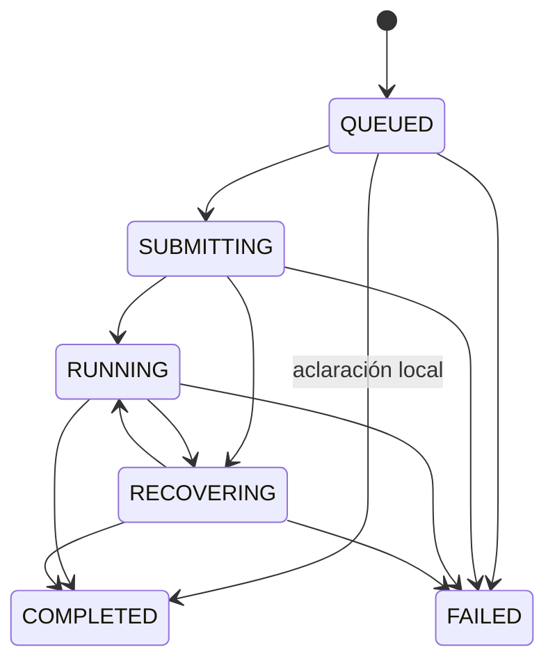

# Entrega asíncrona de análisis

Estado: diseño de referencia de fase 1; backend (fase 2) y frontend (fase 3) implementados el 29/09/2026.
La fase 3 activa async por defecto. Prueba real inicial completada el 30/09/2026; se corrige el arranque de sesiones sin entorno descrito más abajo. Véase la [guía de operación](../POC/cross-check-service/docs/async-analysis.md).
Esta propuesta no cambia las instrucciones del agente ni autoriza otra inferencia real.

## Objetivo y alcance

La prueba political-v9 terminó en OpenAI a los 106 s, pero el cliente recibió un 504
a los 90,298 s. Queremos entregar el resultado del mismo trabajo aunque el navegador
se desconecte o Java se reinicie. Una petición HTTP corta registra el trabajo; un
ejecutor independiente lo procesa; las consultas de estado solo leen datos locales.

La POC tendrá una instancia Java, una cola persistida en base de datos y polling HTTP.
No necesita un broker, WebSockets ni webhooks para este alcance. No ofrece ejecución
exactamente una vez frente a cualquier fallo remoto: ante un envío ambiguo prioriza
no duplicar inferencias, aunque ese trabajo requiera intervención.

## Contrato propuesto

Se añaden endpoints; `/api/analysis/start` conserva temporalmente su contrato síncrono
para que el frontend actual siga funcionando durante la fase Java.

| Operación | Petición | Respuesta |
|---|---|---|
| Registrar trabajo | `POST /api/analysis/jobs` | `202` y representación del trabajo persistido |
| Recuperar estado o resultado | `GET /api/analysis/jobs/{analysisId}` | `200` y representación actual |
| Recuperar un POST cuya respuesta se perdió | Repetir el POST con idéntica clave, credencial y cuerpo | Mismo trabajo; `202` si sigue activo, `200` si ya terminó |

Cuerpo del POST: los campos actuales `text` y `conversationToken` (null para conversación
nueva). Se conservan las validaciones de longitud y del token. No se envían identificadores
de sesión o turno de OpenAI desde el navegador.

Cabeceras del POST: `Idempotency-Key` (UUID v4) y `Authorization: Bearer <jobAccessToken>`.
El GET requiere el mismo Bearer. `jobAccessToken` es una credencial aleatoria por trabajo
de 32 bytes, codificada como Base64URL sin padding; no es la clave OpenAI ni el token de
conversación. El navegador genera y guarda clave, credencial y cuerpo antes del primer POST.
Esto permite recuperarlo aunque nunca haya recibido el `202`. Si no puede guardarlos,
no envía la consulta y explica el problema de almacenamiento.

El servidor guarda SHA-256 de la credencial, nunca la credencial en claro. UUID o clave
de idempotencia por sí solos no permiten leer resultados. La credencial tiene permiso
únicamente sobre ese trabajo; no sustituye una futura autenticación de usuario. En la
POC se conserva junto al historial local, con el mismo alcance de dispositivo/navegador.
No va en URLs ni logs. Se responde `Cache-Control: no-store`.

La representación tiene siempre estos campos; valores desconocidos o no aplicables son null:

| Campo | Semántica |
|---|---|
| `analysisId` | UUID del trabajo, estable |
| `status` | Uno de los estados de la siguiente sección |
| `createdAt`, `updatedAt` | Instantes UTC ISO-8601 |
| `completedAt` | Instante de finalización local, o null |
| `expiresAt` | Fin de disponibilidad del recurso |
| `pollAfterSeconds` | Intervalo sugerido mientras esté activo; null al terminar |
| `result` | Resultado final validado, o null |
| `error` | Error terminal del trabajo, o null |

`result` conserva el contrato de `StartAnalysisResponse`: `analysis`, `clarification`
y `conversationToken`. Exactamente uno de analysis/clarification es no nulo. Una pregunta
de aclaración completa este trabajo; responderla crea otro trabajo con nueva clave y
el token de conversación recibido. CONTEXT_UNAVAILABLE sigue devolviendo aclaración
con token null, sin contactar con OpenAI.

POST nuevo: `Location: /api/analysis/jobs/{analysisId}`, `Retry-After: 3` y cuerpo de estado.
GET puede devolver COMPLETED aunque el cliente nunca haya visto RUNNING. Un trabajo
FAILED se obtiene mediante HTTP 200 con `error`; un fallo del endpoint GET es un error
HTTP distinto y no modifica el trabajo.

Errores de acceso o admisión:

| HTTP / código | Comportamiento |
|---|---|
| 400 / INVALID_ANALYSIS_INPUT | Validación de campos; no se crea trabajo |
| 400 / INVALID_CONVERSATION_REFERENCE | Token inválido o revisión incompatible |
| 410 / CONVERSATION_REFERENCE_EXPIRED | Token caducado antes de aceptar trabajo nuevo |
| 409 / IDEMPOTENCY_CONFLICT | Misma clave y credencial con otro cuerpo |
| 409 / ANALYSIS_CONFLICT | Otro trabajo activo para la misma conversación |
| 429 / ANALYSIS_CAPACITY_EXCEEDED | Cola llena; no trabajo nuevo; Retry-After |
| 401 / INVALID_JOB_CREDENTIAL | Bearer ausente o con formato inválido |
| 404 / ANALYSIS_JOB_NOT_FOUND | ID inexistente o credencial distinta, sin distinguirlos |
| 410 / ANALYSIS_JOB_EXPIRED | Recurso caducado, solo tras autenticar su tombstone |
| 503 / ANALYSIS_STORAGE_UNAVAILABLE | No se pudo persistir; no se llama al proveedor |

Un POST con clave existente y otra credencial devuelve 404 sin revelar el trabajo.
En un replay autenticado se busca primero el registro antes de revalidar caducidad del
token de entrada, revisión activa o capacidad: un trabajo ya aceptado sigue recuperable.
La igualdad usa un hash de serialización canónica de text y conversationToken, con
versión de canonicalización; no se recorta ni cambia semánticamente el texto.

## Estados y transiciones

| Estado | Significado | Transiciones permitidas |
|---|---|---|
| QUEUED | Guardado, sin intento de envío | SUBMITTING, COMPLETED local, FAILED |
| SUBMITTING | Intento persistido antes de contactar con OpenAI | RUNNING, RECOVERING, FAILED |
| RUNNING | Envío aceptado; seguimiento del mismo trabajo remoto | COMPLETED, RECOVERING, FAILED |
| RECOVERING | Se reconcilia un envío incierto o se recupera comunicación | RUNNING, COMPLETED, FAILED |
| COMPLETED | Resultado y contexto final guardados atómicamente | Ninguna |
| FAILED | Fallo terminal local; no significa necesariamente cancelación remota | Ninguna |

El borrado por retención no es una transición de ejecución. El GET de un tombstone
autenticado devuelve 410. No se emiten porcentajes de progreso ficticios.

Errores terminales iniciales: INVALID_ANALYSIS_OUTPUT, ANALYSIS_PROVIDER_FAILED,
ANALYSIS_SUBMISSION_UNKNOWN, ANALYSIS_DEADLINE_EXCEEDED, ANALYSIS_QUEUE_EXPIRED,
ANALYSIS_REVISION_UNAVAILABLE y ANALYSIS_PROVIDER_ACTION_REQUIRED. `error` contiene
`code`, `message` en español, `requestId` de creación y `executionState`:
NOT_STARTED, CONFIRMED o UNKNOWN. CONFIRMED indica envío confirmado, no éxito.
Nunca convertir un error técnico en INSUFFICIENT_EVIDENCE ni reparar una salida inválida.

## Persistencia y transacciones

Propuesta para esta POC: H2 en fichero, con JDBC y migraciones versionadas. Una instancia
abre la base; el repositorio oculta el motor para permitir PostgreSQL si el despliegue
crece. H2 ofrece almacenamiento persistente y transacciones; el modo embebido limita
la base a una JVM. [Documentación H2](https://www.h2database.com/html/features.html).

Ruta propuesta: `POC/cross-check-service/data/cross-check`, configurable mediante ruta
absoluta. Los archivos de base se excluirán de Git en fase 2; nunca estarán en target.
Sin consola H2 expuesta. No se instala ni crea ninguna base en esta fase. Los textos
persistidos son datos locales privados; el cifrado del token de conversación no cifra
automáticamente la base de datos.

Modelo lógico:

| Tabla | Datos e invariantes |
|---|---|
| `analysis_job` | ID, clave única de idempotencia, hash de acceso, hash/canonicalización del cuerpo, entrada y snapshot aceptados, provider, agentId/revision/schemaVersion, estado, fechas/límites, referencias session/turn/previousTurn, intento, resultado/error, leaseOwner/leaseUntil/version |
| `conversation_state` | Sesión única, activeJobId, último contexto aceptado y bloqueo por ejecución remota incierta |
| `conversation_context` | Snapshot inmutable con ID, sesión, entrada anterior, objetivo, proposiciones, pregunta pendiente y caducidad |
| `analysis_job_tombstone` | ID, clave, hash de acceso/hash de cuerpo y caducidad del tombstone; sin consulta ni resultado |

Transacción de admisión: buscar replay; validar entrada/contexto/revisión; reservar
conversación y capacidad; insertar QUEUED; confirmar; devolver 202. No hacer llamadas
HTTP dentro de una transacción. Una clave única resuelve POST simultáneos. La tabla de
trabajos es la cola; un aviso en memoria puede acelerar el despertar, pero no es requisito.

El worker toma un lease mediante compare-and-set de versión, sin mantener una conexión
SQL durante esperas HTTP. Cada escritura exige el lease y la versión vigentes. Al perder
el lease deja de emitir operaciones; un SUBMITTING abandonado pasa a reconciliación,
nunca se vuelve a enviar por el mero hecho de caducar el lease. No usar interrupciones
de hilos como mecanismo de cancelación de operaciones de la base embebida.

Transacción final: validar salida, calcular veredicto, crear snapshot, emitir y guardar
token de conversación, guardar resultado COMPLETED y liberar conversación/capacidad.
Si falla la escritura, recuperar el mismo resultado remoto; no pedir otro análisis.
La expiración del token se fija al completar, no se renueva en cada GET. El resultado
guardado se devuelve idéntico en recuperaciones posteriores.

El token de entrada se valida al aceptar. Su expiración mientras el trabajo está en cola
no invalida el snapshot ya aceptado. El trabajo conserva una copia independiente del
contexto de entrada hasta terminar. Los contextos de salida duran las 2 horas actuales;
los resultados pueden consultarse más tiempo, pero un token caducado no habilita seguimiento.
Una sesión solo admite un trabajo activo. Un seguimiento con snapshot antiguo respecto
al último aceptado devuelve conflicto; no mezcla historia remota nueva con contexto viejo.

## Envío y recuperación de OpenAI

El adaptador actual crea sesión y envía input en una misma llamada, y conserva referencias
solo dentro de analyze(). Debe separarse en preparar sesión, enviar, consultar turno y
recuperar salida, con checkpoints persistidos. No basta con envolver analyze() en @Async.

Corrección validada el 30/09/2026: para conversación nueva con environment.type=none,
crear la sesión CON input y metadata de correlación. La API requiere input inicial en
este modo. Persistir antes la huella y el intento; tras aceptación, pasar directamente
a polling sin enviar el mismo mensaje por events. Los seguimientos sí usan events.
[OpenAI Docs: sesiones](https://developers.openai.com/api/docs/guides/agents-api/sessions).

Para cada envío: persistir intento, clave remota estable, cuerpo exacto, instante y
previousTurnId antes del POST. Los eventos exponen Idempotency-Key, pero esta propuesta
no presupone retención ilimitada ni habilita reenvíos automáticos hasta verificar su
semántica concreta. [OpenAI Docs: eventos](https://developers.openai.com/api/reference/python/resources/beta/subresources/agents/subresources/sessions/subresources/events/methods/create).

Recuperación conservadora:

| Punto del fallo | Acción |
|---|---|
| Antes del commit de QUEUED | No ejecución remota; el cliente puede repetir el POST idéntico |
| Tras commit, antes de recibir 202 | Replay devuelve mismo ID y no duplica cola |
| QUEUED tras reinicio | Retomar trabajo guardado |
| Respuesta de creación de sesión perdida | Reconciliar por metadata exacta, agente e input del turno: el análisis puede haber comenzado; nunca recrear ni reenviar por events a ciegas |
| Sesión existente de seguimiento, envío todavía no intentado | Enviar una vez tras registrar intento; una sesión nueva ya contiene el input inicial |
| Intento SUBMITTING sin confirmación | RECOVERING; GET de sesión, turnos e items; nunca volver a QUEUED ni reenviar a ciegas |
| Envío confirmado, turnId no guardado | Encontrar turno nuevo respecto a previousTurnId y verificar su input; si hay varios candidatos o no se puede demostrar correspondencia, mantener incertidumbre |
| turnId guardado | Consultar ese turno exacto, nunca el último sin comprobar |
| Turno completed, resultado no guardado | Descargar misma salida, validar y completar localmente |
| Token/contexto/resultado ya guardados, GET perdido | Devolver resultado persistido idéntico |

La ausencia de un turno en una lectura no demuestra que el POST no llegase. Comparar
texto o fecha únicamente tampoco prueba identidad. La correlación exige sesión propia,
reserva exclusiva, checkpoint anterior y evidencia del input/evento; si no hay evidencia
suficiente, finalizar con ANALYSIS_SUBMISSION_UNKNOWN al vencer el plazo de recuperación.
Un GET transitorio con 429/5xx permite reintento con backoff y Retry-After; un POST
ambiguo no. Una salida inválida falla localmente sin otra inferencia.

Si FAILED tiene ejecución remota desconocida o todavía activa, mantener la conversación
en cuarentena y la reserva de capacidad remota; no liberar ambos porque venció un plazo
local. Un reconciliador de solo lectura puede confirmar posteriormente el final y liberar
la reserva, sin cambiar el resultado terminal ni ejecutar inferencia. La cancelación
remota no se promete en esta fase. Si no se puede confirmar, se requiere intervención.

La revisión y el esquema se fijan al aceptar el trabajo. Recuperar trabajos enviados
usa el lector fijado. Un QUEUED de revisión antigua no se envía contra un agente remoto
modificado: se falla con ANALYSIS_REVISION_UNAVAILABLE/NOT_STARTED. Durante publicaciones
se debe drenar o bloquear admisión; guardar una revisión local no congela el agente remoto.

## Límites propuestos y comportamiento del frontend

| Parámetro | Valor inicial de diseño |
|---|---|
| Timeout de POST/GET del navegador | 15 s, recuperable sin nueva inferencia |
| Polling del navegador | 3 s; backoff hasta 15 s ante errores; pausa si está oculto |
| Consultas remotas del worker | 3 s; backoff hasta 30 s y jitter |
| Timeout de cada llamada remota | 15 s, acotado por el plazo restante |
| Plazo en cola | 2 min desde aceptación; si vence, NOT_STARTED |
| Plazo de ejecución/recuperación activa | 10 min desde primer intento remoto; no reinicia tras reboot |
| Lease del worker | 60 s; renovable; sin reasignar un envío incierto |
| Concurrencia remota / trabajos pendientes | 2 / 20; cuarentenas cuentan en la capacidad remota |
| Retención del trabajo | 24 h desde aceptación; no renovada por GET |
| Tombstone de idempotencia | Hasta 7 días desde aceptación |

Estos valores son propuestas locales, no límites de coste ni garantías del proveedor.
Al vencer el plazo de ejecución se informa del fallo local; no se afirma que OpenAI haya
parado o dejado de consumir. Al caducar el resultado se retiran consulta, contexto copiado
y salida; los identificadores mínimos de trabajos remotos inciertos se mantienen hasta
resolver la cuarentena. Después del tombstone no se garantiza deduplicación: el cliente
nunca reenvía automáticamente una operación antigua fuera de la ventana de retención.

Mensajes: QUEUED «Consulta en espera»; SUBMITTING/RUNNING «Analizando tu consulta»;
RECOVERING «Estamos recuperando el estado de tu análisis». Un fallo de polling muestra
«Conexión interrumpida; recuperaremos este análisis» y conserva el ID. A los 90 s se
puede mostrar «El análisis está tardando más de lo habitual», sin convertirlo en error.
Cerrar la pestaña no cancela el trabajo. Borrar historial elimina acceso local, no detiene
OpenAI; la UI debe explicar esa consecuencia. Una nueva consulta siempre es una acción
expresa, no la respuesta automática a una desconexión.

Al recargar: si hay ID, GET; si solo hay envío pendiente persistido, POST idéntico con
misma clave/credencial/cuerpo dentro de la ventana. No ofrecer un botón que genere una
clave nueva bajo la etiqueta «Recuperar». Al completar una aclaración se habilita el
seguimiento. Eliminar dependencias del temporizador de 90 s de la petición síncrona.

## Migración y verificación antes de activar

Fase 2: repositorios, migraciones, endpoints, worker y adaptador dividido, con proveedor
HTTP simulado. El endpoint síncrono debe compartir repositorio de reservas/contextos y
capacidad mientras conviva con jobs, o se habilitarán de forma mutuamente excluyente;
no mantener dos semáforos independientes sobre las mismas sesiones. La modalidad elegida
para la POC será activación excluyente: async deshabilitado por defecto hasta cambiar FE;
con async activo, start devuelve 409 ASYNC_ANALYSIS_REQUIRED sin llamar a OpenAI.

Fase 3: frontend, historial y activación coordinada. Los informes históricos permanecen
legibles. Tokens de contexto anteriores en memoria no se migran mágicamente: si falta
el snapshot, aclaración CONTEXT_UNAVAILABLE. No publicar otra revisión del agente solo
por cambiar el transporte HTTP. Una prueba real final requiere autorización aparte.

| Caso de aceptación futuro | Resultado exigido |
|---|---|
| Proveedor tarda 106 s | 202 rápido y posterior COMPLETED, sin 504 del análisis |
| POST concurrente duplicado | Un trabajo y como máximo un envío de input |
| Misma clave, distinto cuerpo | 409; sin segundo envío |
| Credencial incorrecta | Sin estado ni resultado filtrados |
| Pérdida de 202 | Recuperación por replay incluso si el token de entrada ya caducó |
| Recarga durante ejecución | Mismo ID y resultado |
| Reinicio antes/durante/después del envío | Checkpoint correcto; no reenvío ambiguo |
| Respuesta remota perdida tras aceptar input | RECOVERING; recuperar mismo turno o incertidumbre explícita |
| Lease vencido con worker antiguo vivo | No doble envío ni escritura obsoleta |
| Dos seguimientos simultáneos | Uno aceptado; otro en conflicto |
| Contexto perdido / antiguo | Aclaración local / conflicto, sin inferencia indebida |
| Resultado inválido / aclaración válida | FAILED sin reparación / COMPLETED con aclaración |
| GET con error temporal | Mantiene trabajo, no genera POST nuevo |
| Vencimiento de plazo con remoto activo | Fallo local honesto; reserva remota no liberada a ciegas |
| Resultado caducado / tombstone | 410 autenticado; sin recreación dentro de ventana |
| Disco/commit falla | Nunca devolver 202 sin persistencia; nunca repetir inferencia al fallar guardado final |
| Cambio de revisión con trabajos pendientes | No mezclar lectores ni enviar con instrucciones distintas |
| Reinicio tras COMPLETED | Mismo resultado y token; contexto persistido utilizable hasta su caducidad |

Las pruebas de reinicio deben cerrar y abrir una base en fichero, no solo recrear un mock.
Esta matriz es un criterio de aceptación pendiente, no una afirmación de cobertura actual.

Ejemplos completos de estados: [async-analysis.examples.json](proposals/async-analysis.examples.json).
La credencial del ejemplo es un marcador, no una credencial utilizable.
